# XTHUD
## 1. 简介
- **V3.0.0 新增 XTPromptHUD 工具类**，HUD 支持在任意位置显示，不再受限于 ArkUI 的 @Component 上下文环境
- 基于ArkUI封装的通用型 LoadingHUD、ToastHUD、ProgressHUD 组件库
- 适配 API11 和 API12 beta1
- 代码测试完成度高，整体 API 简单易用
- V1.1.0 新增 XTEasyHUD 工具类，HUD 无需挂载即可直接使用
- HUD 组件基于 CustomDialogController/ComponentContent 定制开发，兼容了物理返回事件导致的 Dialog 关闭问题
- HUD 支持多种默认样式，样式支持高度自定义
- HUD 支持响应式更新自定义样式和 text，且不会重复创建 Dialog 实例
- 单类型 HUD 为全局唯一 Dialog 实例，避免重复创建导致的内存消耗问题，避免叠加显示和切换显示闪烁问题
- ToastHUD 除了支持常规模式，还支持队列弹出模式
- LoadingHUD 支持 ArkUI 的 LoadingProgress 样式，支持自定义加载样式，支持 SVG 动效
- ProgressHUD 基于 Progress 组件做了逻辑封装

组件设计思想：
1. [好用的Toast/Loading/Progress自定义组件XTHUD](https://juejin.cn/post/7378702404320149544)
2. [鸿蒙ArkUI自定义组件的构造原理探索——如何封装一个好用的Toast/Loading/ProgressHUD组件](https://juejin.cn/post/7379836868696801315)
3. [鸿蒙自定义 Dialog 的 6 种方式](https://juejin.cn/post/7391699542008430601)
4. [鸿蒙开发中自定义全局组件 UI 构建异常问题和解决](https://juejin.cn/post/7392250499151446016)

Demo和详细文档参考：
- [XTHUD Demo](https://gitee.com/kukumalu/xthud)

## 2. 下载安装
注意：
1. V2/V3 版本后将强制依赖 API12 环境（5.0.0(12)），API11 无法使用
```
ohpm install @jxt/xt_hud
```

2. 如需兼容 API11（4.1.0(11)） 请使用 v1.2.1
```
ohpm install @jxt/xt_hud@1.2.1
```

3. 注意平台显示的包体积和文件数包含了 README 的图片素材文件和 example 文件，实际该组件库仅包含 9 个代码文件和 7 个资源文件

## 3. 部分样式展示
HUD 均有默认样式，也均支持自定义样式，且 Loading 和 Progress 的 text 可以不显示。

| HUD类型                               | 预览效果                                     |
|-------------------------------------|------------------------------------------|
| text toast                          | 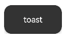       |
| info toast                          |      |
| warning toast                       | 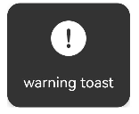     |
| success toast                       |        |
| error toast                         | 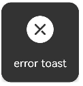       |
| harmony loading + text              |    |
| ring loading + text                 |  |
| custom svg loading                  |  |
| custom svg loading                  |  |
| progress ring without text          | 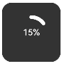 |
| progress ring + text + custom style |  |
| progress bar + text + custom style  |  |

## 4. API 文档
### 4.0. 新特性简介
#### v3.4.0
1. CustomHUD 新增 supportMultilayer 属性，支持多个自定义弹窗堆叠显示，默认为 false，也就是单层显示
2. 某些场景中，使用 CustomHUD 自定义不同类别弹窗，原有的单层弹窗多次执行仅更新数据的模式无法满足需求，需要支持多层自定义弹窗显示
3. supportMultilayer 支持全局配置或者独立配置，框架内部维护弹窗栈逻辑，使用方无需关心实现细节

#### v3.3.0
1. 去除了 XTPromptHUD 内部的 UIContext 自动异步获取的兜底策略，避免出时序问题！ 
2. 之前的自动兜底策略获取的是 LastWindow 的 UIContext，所以针对 subwindow 的显示一定会出问题！ 
3. 后续版本的 XTPromptHUD 使用，UIContext 必须显示指定一次，强烈建议全局初始化阶段执行 globalConfigXXX API 去配置 UI 上下文 
4. XTPromptHUD 的所有 HUD 的 show 操作，从上个版本开始均已支持 uiContext 配置属性，支持动态设置，也就是临时更新 UI 上下文 
5. 用户必须清楚并自行决定自己的 HUD 所要显示的 window 层级，或者说是 UI 上下文，默认是 mainWindow 的 
6. 放开了 asyncGetLastWindowUIContext API，用户可以自行决定是否使用该 API 获取 UIContext
> 🌟 注意：
> 1. 如果不设置 UIContext ，直接 show PromptHUD，该版本会强制触发内部的异常提示导致 crash，所以谨慎更新该版本！
> 2. 新版本使用，只需稍微适配一下即可，使用也会更加规范，避免后续出不必要的 bug 问题。
> 3. 如果之前使用已经使用了 globalConfigXXX API，无需更改代码即可继续使用

#### v3.2.0
1. XTHUD 系列组件和 XTHUDManager 标识废弃，后续不再维护更新 
2. XTEasyHUD 标识废弃，后续不再维护更新 
3. XTPromptHUD.showRingLoading 新增 strokeBackgroundColor 属性，支持自定义 loading 环背景色 
4. XTPromptHUD.ProgressHUD 新增 strokeBackgroundColor 属性，支持自定义加载进度背景色 
5. XTHUDReactiveBaseOptions 新增 uiContext 属性，支持 HUD 在执行显示阶段重新自定义 UI 上下文，指定显示 window 层级
```typescript
// 进度背景色 strokeBackgroundColor
XTPromptHUD.showBarProgress(this.progress, '', {
  strokeWidth: 8,
  tintColor: Color.Orange,
  strokeBackgroundColor: Color.Gray
})

// 指定显示 uiContext       
XTPromptHUD.showRingLoading('加载中...', {
  uiContext: this.getUIContext(),
  strokeBackgroundColor: Color.Gray
})
```

#### v3.1.4
1. 使用 Beta1(5.0.3.806) 构建
2. 新增 showInSubWindow 属性，支持在子窗口中显示 HUD
3. 新增 keyboardAvoidMode 属性，支持键盘避让模式设置，注意该属性为 5.0.3.806 新增！
4. 注意 showInSubWindow = true 时，KeyboardAvoidMode.DEFAULT 失效，这应该是系统特性

#### v3.1.3
1. ProgressHUD 新增 autoHideWhenProgressCompletion 属性，支持用户自定义 ProgressHUD 的自动隐藏逻辑

#### v3.1.2
1. HUD 的 Text 显示新增 font 属性，可以用于自定义 fontWeight、fontFamily、fontStyle
2. HUD 的 Text 显示新增 lineHeight 属性 
3. ProgressHUD 的进度字体样式控制拆分，新增 progressFont、progressTextColor 属性

#### v3.1.0
1. 所有的 HUD（XTHUDManager、XTEasyHUD、XTPromptHUD）的 text 入参由 string 类型改为 ResourceStr，支持多语言配置 
2. 修复 XTEasyHUD 的 UI 上下文安全性问题，避免在异步等场景中无法显示，现在无需注册即可安全的使用 XTEasyHUD
```typescript
/// 支持 Resource 入参
XTPromptHUD.showToast($r('app.string.hud_toast'))
XTPromptHUD.showLoading($r('app.string.hud_loading'))

XTEasyHUD.showToast($r('app.string.hud_toast'))
XTEasyHUD.showLoading($r('app.string.hud_loading'))

XTHUDManager.showToast($r('app.string.hud_toast'))
XTHUDManager.showLoading($r('app.string.hud_loading'))        
        
/// 异步场景可直接使用        
async asyncShowToast() {
  XTPromptHUD.showLoading()

  let response: AxiosResponse<string> = await axios.get('https://www.baidu.com')
  console.log('end', response.data)

  XTPromptHUD.hideLoading()
  XTPromptHUD.showToast('请求完成')
}

/// 异步场景可直接使用
async asyncShowToast() {
  XTEasyHUD.showLoading()

  let response: AxiosResponse<string> = await axios.get('https://www.baidu.com')
  console.log('end', response.data)

  XTEasyHUD.hideLoading()
  XTEasyHUD.showToast('请求完成')
}
```

#### v3.0.2
1. XTPromptHUD 增加免注册能力，初始不执行手动全局配置也可只接使用 HUD，此时将默认使用当前 window 的 context，但并不太推荐这种方式，默认会有 warn log
2. 修改所有的 ToastHUD 在 text 传值为空串时，将屏蔽显示逻辑，避免显示空 toast

#### v3.0.0
1. V3 版本强制依赖 API12 环境（5.0.0(12)），API11 无法使用，如需适配 API11 请使用 v1.2.1 
2. 新增 XTPromptHUD 工具类，基于 ComponentContent 重构 HUD 渲染逻辑，不再受限于 ArkUI 的 @Component 上下文环境 
3. XTPromptHUD 完全兼容历史版本的 API，仅作类名替换和内部实现重写，升级替换友好
4. 支持在 EntryAbility 中显示 HUD
5. 支持在 Promise 异步环境中显示 HUD 
6. XTPromptHUD 新增 showCustomHUD API，支持自定义弹出层显示，支持例如开屏广告的业务场景自定义实现 
7. 新增 onPressBack 回调，可以避免设置 closeOnPressBack = false 后，系统返回响应丢失 
8. 后续版本将主推 XTPromptHUD，XTEasyHUD 和 XTHUDManager 将不再更新维护
```typescript
// 在 windowStage.loadContent 中初始化配置
onWindowStageCreate(windowStage: window.WindowStage): void {
  windowStage.loadContent('pages/Index', (err) => {
    if (err.code) {
      return
    }
    // 初始化
    XTPromptHUD.globalConfigToast(windowStage.getMainWindowSync().getUIContext(), (options: XTHUDToastOptions) => {
      options.isQueueMode = true
    })
    XTPromptHUD.globalConfigLoading(windowStage.getMainWindowSync().getUIContext(), (options: XTHUDLoadingOptions) => {
      options.isModal = true
    })
    XTPromptHUD.globalConfigProgress(windowStage.getMainWindowSync().getUIContext(), (options: XTHUDProgressOptions) => {
      options.isModal = true
    })
    XTPromptHUD.globalConfigCustomHUD(windowStage.getMainWindowSync().getUIContext(), (options: XTHUDReactiveBaseOptions) => {
      options.isModal = true
    })
  });
}
```
```typescript
// 在根组件中初始化
aboutToAppear () {
  XTPromptHUD.globalConfigCustomHUD(this.getUIContext(), (options: XTHUDReactiveBaseOptions) => {
    options.isModal = false
  })
}
```
```typescript
/// 异步使用场景
async asyncShowToast() {
  /// 临时获取当前 window 的 uiContext，不太推荐该方式，可能无法安全获取到 uiContext
  /// 如果已经在 onWindowStageCreate 或其他场景中进行了全局配置，这里无需二次操作 getContext，仅作演示使用
  let windowClass = await window.getLastWindow(getContext())
  let uiContext = windowClass.getUIContext()

  XTPromptHUD.globalConfigLoading(uiContext)
  XTPromptHUD.showLoading()

  let response: AxiosResponse<string> = await axios.get('https://www.baidu.com')
  console.log('end', response.data)

  XTPromptHUD.hideLoading()

  XTPromptHUD.globalConfigToast(uiContext)
  XTPromptHUD.showToast('请求完成')
}
```

- 开屏广告、悬浮视图演示：

    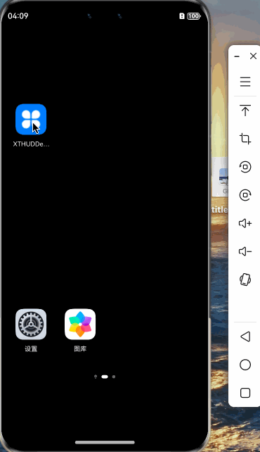
    

#### v2.0.1
1. 仅支持 API12，API11 无法使用，如需兼容 API11 请使用 v1.2.1 
2. 新增 closeOnPressBack 属性，可控制是否点击系统返回键时关闭 HUD，默认 false，开启后触发返回关闭会执行 onCancel 
3. 新增 closeOnClickOutside 属性，可控制是否点击 HUD 背景时关闭（isModal 为 true 时生效），默认 false，开启后触发点击背景关闭会执行 onCancel 
4. 上述两个新增属性，仅支持全局配置，默认值 false 无需设置
```typescript
XTEasyHUD.globalConfigToast((options: XTHUDToastOptions) => {
  options.isModal = true
  options.closeOnClickOutside = true
  options.closeOnPressBack = true
})
XTEasyHUD.globalConfigLoading((options: XTHUDLoadingOptions) => {
  options.closeOnClickOutside = false
  options.closeOnPressBack = false
})
XTEasyHUD.globalConfigProgress((options: XTHUDProgressOptions) => {
  options.closeOnClickOutside = false
  options.closeOnPressBack = false
})
```

#### v1.2.0
1. 新增 iconMargin、textPadding 样式自定义属性支持
2. 新增 minWidth、maxWidth 样式自定义属性支持
3. HUD 整体样式自定义自由度度进一步提升
```typescript
XTHUDManager.showError('错误弹窗 错误弹窗 错误弹窗 错误弹窗', {
  isQueueMode: true,
  tintColor: Color.Red,
  iconMargin: 10,
  textPadding: {
    left: 0,
    right: 10,
    bottom: 10,
    top: 10,
  },
  maxWidth: '100%',
  backgroundColor: '#80FF0000',
  iconSize: { width: 150, height: 100 },
  onCompletion: () => {
    console.log('错误弹窗 正常关闭')
  },
  onCancel: () => {
    console.log('错误弹窗 被返回关闭')
  }
})

XTEasyHUD.showRingLoading('加载中...', {
  iconMargin: 40,
  textPadding: {
    left: 10, right: 10, top: 0, bottom: 40
  },
  minWidth: 200,
  onCompletion: () => {
    console.log('Ring loading complete')
  },
  onCancel: () => {
    console.log('Ring loading canceled')
  }
})
```

#### v1.1.0
1. 新增 XTEasyHUD 工具类，该工具类可使得 HUD 无需事先挂载即可直接使用，相对比较方便
2. 注意 XTEasyHUD 和传统的 XTHUDManager 的使用方式二者不要同时混用，选择任一方式 import 即可，否则可能会有不可知的错误问题
3. XTEasyHUD 使用了一些非常规的组件挂载手段，具体参考 [鸿蒙ArkUI自定义组件的构造原理探索——如何封装一个好用的Toast/Loading/ProgressHUD组件](https://juejin.cn/post/7379836868696801315) 一文。
4. 详细使用方法参考 Demo 部分
```typescript
import { XTEasyHUD } from '@jxt/xt_hud'

// Toast 全局配置，如无特殊需要，可以不配置，其他 HUD 同理
XTEasyHUD.globalConfigToast((options: XTHUDToastOptions) => {
  options.isQueueMode = false
  options.hidingDelay = 1000
  options.isModal = false
  options.alignment = DialogAlignment.Center
})

// Toast 显示
XTEasyHUD.showToast('success')

// Loading 显示
XTEasyHUD.showLoading('...')
setTimeout(() => {
  XTEasyHUD.hideLoading()
}, 3000)

// Progress 显示
this.progress = 0
this.interval = setInterval(() => {
  this.progress ++
  XTEasyHUD.showProgress(this.progress)
  if (this.progress >= 100) {
    clearInterval(this.interval)
    this.interval = null
  }
}, 100)
```

### 4.1. 配置项
自定义样式等配置
```typescript
/// HUD默认配置，不支持动态响应，仅支持在组件初始化阶段设置
export interface XTHUDBaseOptions {
  /// HUD竖直方向上的显示位置，默认值DialogAlignment.Center
  alignment?: DialogAlignment
  /// HUD相对alignment所在位置的偏移量，默认值{ dx: 0, dy: 0 }
  offset?: Offset
  /// 遮罩颜色，默认值 Color.Transparent，仅isModal==true时有效
  maskColor?: ResourceColor
  /// 开启动画，默认值为空，不设置，针对 XTPromptHUD 无效
  openAnimation?: AnimateParam
  /// 关闭动画，默认值为空，不设置，针对 XTPromptHUD 无效
  closeAnimation?: AnimateParam
  /// 过渡动画，仅针对 XTPromptHUD 生效，默认为系统默认效果，可设置 asymmetric 区分开启关闭过渡动效
  transition?: TransitionEffect | null
  /// 是否为全屏，屏蔽交互，根据HUD类型区分，toast默认false，其他默认true
  isModal?: boolean
}
/// HUD响应配置，支持后续动态更新
export interface XTHUDReactiveBaseOptions extends XTHUDBaseOptions {
  /// HUD结束回调
  onCompletion?: XTHUDCallback
  /// HUD取消回调，点击物理返回键，会触发提前关闭，该回调与onCompletion互斥，注意处理
  /// closeOnPressBack 设置为 true 才会触发回调
  onCancel?: XTHUDCallback
  /// HUD显示后，点击系统返回的回调，仅在 closeOnPressBack 为 false 时生效，为 true 会执行 onCancel
  /// !!! 注意处理这个事件，否则 closeOnPressBack 为 false 时点击系统返回无响应
  /// !!! 如果使用 XTPromptHUD.showCustomHUD 显示了全局自定义悬浮 HUD，该事件将代理全局的系统返回事件，注意影响
  onPressBack?: XTHUDCallback
  /// 是否点击系统返回键时关闭 HUD，默认 false，开启后触发返回关闭会执行 onCancel
  /// 注意处理 onPressBack 这个事件，否则 closeOnPressBack 为 false 时点击系统返回无响应
  closeOnPressBack?: boolean
  /// 是否点击 HUD 背景时关闭（isModal时生效），默认 false，开启后触发点击背景关闭会执行 onCancel
  closeOnClickOutside?: boolean
}
export interface XTHUDReactiveOptions extends XTHUDReactiveBaseOptions {
  /// 文本字体
  fontSize?: number | string | Resource
  /// 文本颜色，默认white
  textColor?: ResourceColor
  /// 主题颜色（toast/loading图标等），默认white
  tintColor?: ResourceColor
  /// HUD背景色，默认值 #CC000000
  backgroundColor?: ResourceColor
  /// HUD圆角，默认值10
  borderRadius?: Length | BorderRadiuses
  /// HUD 最小宽度约束，默认值配合 margin 和 padding 的默认值
  minWidth?: Length
  /// HUD 最大宽度约束，默认值 '60%'，一般不建议修改
  maxWidth?: Length
}
/// Toast配置
export interface XTHUDToastOptions extends XTHUDReactiveOptions {
  /// 自定义图标
  iconSrc?: PixelMap | ResourceStr | DrawableDescriptor | null
  /// 图标尺寸，默认值宽高 48vp
  iconSize?: SizeOptions
  /// 图标 margin，默认值 20vp，注意 HUD 宽度受 minWidth 约束
  iconMargin?: Margin | Length | LocalizedMargin
  /// 文本 padding，纯文本样式 top 生效，带图标样式，top 设置无效。以 iconMargin.bottom 为准
  /// 默认值 20vp，注意 HUD 宽度受 minWidth 约束
  textPadding?: Padding
  /// toast自动关闭时间间隔，默认值 2000ms
  hidingDelay?: number
  /// toast队列显示模式，一个个显示，直到结束，默认false，同时只显示一个
  /// 注意队列模式的toast不支持和其他非队列模式的toast混合使用，会被覆盖
  isQueueMode?: boolean
}
/// Loading配置
export interface XTHUDLoadingOptions extends XTHUDReactiveOptions {
  /// 自定义loading图标，建议使用svg动效
  iconSrc?: PixelMap | ResourceStr | DrawableDescriptor | null
  /// loading图标尺寸
  iconSize?: SizeOptions
  /// 图标 margin，默认值 20vp，注意 HUD 宽度受 minWidth 约束
  iconMargin?: Margin | Length | LocalizedMargin
  /// 文本 padding，top===0
  /// 默认值 20vp，注意 HUD 宽度受 minWidth 约束
  textPadding?: Padding
  /// 环形loading的环宽度，其他样式设置无效
  strokeWidth?: Length
}
/// Progress配置
export interface XTHUDProgressOptions extends XTHUDReactiveOptions {
  /// 进度字体
  progressFontSize?: number | string | Resource
  /// progress图标尺寸
  iconSize?: SizeOptions
  /// 图标 margin，默认值 20vp，注意 HUD 宽度受 minWidth 约束
  iconMargin?: Margin | Length | LocalizedMargin
  /// 文本 padding，top===0
  /// 默认值 20vp，注意 HUD 宽度受 minWidth 约束
  textPadding?: Padding
  /// bar和ring宽度
  strokeWidth?: Length
  /// 扫描动画效果
  enableScanEffect?: boolean
}
```

### 4.2. XTPromptHUD
XTPromptHUD 脱离 ArkUI 的装饰器环境，基于 ComponentContent 构建 HUD，自由度进一步提升
```typescript
export class XTPromptHUD {
  /**
   * Toast全局配置，必须在 windowStage.loadContent 后执行 UIContext 赋值
   * 其他全局样式配置为可选操作，不配置就是默认样式
   * !!! 注意设置全局配置后，必须通过指定 show 事件中的 options 才可以刷新样式配置，但不做全局覆盖
   * !!! 想要重置全局配置，需要手动执行 globalDestroyToast 后重新执行 globalConfigToast
   *
   * @param { uiContext } UIContext，必传，例如 windowStage.getMainWindowSync().getUIContext() 或者 组件内的 this.getUIContext()
   * @param { globalOptions } 样式配置回调函数，XTHUDBaseOptions部分可在此设置，后续无法动态更新，其他样式可动态配置
   */
  static globalConfigToast(
    uiContext: UIContext,
    globalOptions?: ((options: XTHUDToastOptions) => void)
  ): void
  /**
   * 销毁全局 toast 单例，后续必须重新执行 globalConfigToast 才可以继续使用 toast
   * !!! 注意销毁执行后，对应 HUD 会全部关闭
   */
  static globalDestroyToast(): void
  /**
   * Loading全局配置，必须在 windowStage.loadContent 后执行 UIContext 赋值
   * 其他全局样式配置为可选操作，不配置就是默认样式
   * !!! 注意设置全局配置后，必须通过指定 show 事件中的 options 才可以刷新样式配置，但不做全局覆盖
   * !!! 想要重置全局配置，需要手动执行 globalDestroyLoading 后重新执行 globalConfigLoading
   *
   * @param { uiContext } UIContext，必传，例如 windowStage.getMainWindowSync().getUIContext() 或者 组件内的 this.getUIContext()
   * @param { globalOptions } 样式配置回调函数，XTHUDBaseOptions部分可在此设置，后续无法动态更新，其他样式可动态配置
   */
  static globalConfigLoading(
    uiContext: UIContext,
    globalOptions?: ((options: XTHUDLoadingOptions) => void)
  ): void
  /**
   * 销毁全局 loading 单例，后续必须重新执行 globalConfigLoading 才可以继续使用 loading
   * !!! 注意销毁执行后，对应 HUD 会全部关闭
   */
  static globalDestroyLoading(): void
  /**
   * Progress全局配置，必须在 windowStage.loadContent 后执行 UIContext 赋值
   * 其他全局样式配置为可选操作，不配置就是默认样式
   * !!! 注意设置全局配置后，必须通过指定 show 事件中的 options 才可以刷新样式配置，但不做全局覆盖
   * !!! 想要重置全局配置，需要手动执行 globalDestroyProgress 后重新执行 globalConfigProgress
   *
   * @param { uiContext } UIContext，必传，例如 windowStage.getMainWindowSync().getUIContext() 或者 组件内的 this.getUIContext()
   * @param { globalOptions } 样式配置回调函数，XTHUDBaseOptions部分可在此设置，后续无法动态更新，其他样式可动态配置
   */
  static globalConfigProgress(
    uiContext: UIContext,
    globalOptions?: ((options: XTHUDProgressOptions) => void)
  ): void
  /**
   * 销毁全局 progress 单例，后续必须重新执行 globalConfigProgress 才可以继续使用 progress
   * !!! 注意销毁执行后，对应 HUD 会全部关闭
   */
  static globalDestroyProgress(): void
  /**
   * 自定义 HUD 全局配置，必须在 windowStage.loadContent 后执行 UIContext 赋值
   * 其他全局样式配置为可选操作，不配置就是默认样式
   * !!! 注意设置全局配置后，必须通过指定 show 事件中的 options 才可以刷新样式配置，但不做全局覆盖
   * !!! 想要重置全局配置，需要手动执行 globalDestroyCustomHUD 后重新执行 globalConfigCustomHUD
   *
   * @param { uiContext } UIContext，必传，例如 windowStage.getMainWindowSync().getUIContext() 或者 组件内的 this.getUIContext()
   * @param { globalOptions } 样式配置回调函数，XTHUDBaseOptions部分可在此设置，后续无法动态更新，其他样式可动态配置
   */
  static globalConfigCustomHUD(
    uiContext: UIContext,
    globalOptions?: ((options: XTHUDReactiveBaseOptions) => void)
  ): void
  /**
   * 销毁全局 customHUD 单例，后续必须重新执行 globalConfigCustomHUD 才可以继续使用
   * !!! 注意销毁执行后，对应 HUD 会全部关闭
   */
  static globalDestroyCustomHUD(): void

  /**
   * Toast，默认不屏蔽用户交互
   * 常规纯文本toast，自定义图标需要实现options.iconSrc
   *
   * @param { string } text 显示文本，必填，不能为空串
   * @param { XTHUDToastOptions? } options 可选自定义样式
   */
  static showToast(text: string, options?: XTHUDToastOptions): void
  /**
   * Toast，默认不屏蔽用户交互
   * 带info图标的文本toast
   *
   * @param { string } text 显示文本，必填，不能为空串
   * @param { XTHUDToastOptions? } options 可选自定义样式
   */
  static showInfo(text: string, options?: XTHUDToastOptions): void
  /**
   * Toast，默认不屏蔽用户交互
   * 带warning图标的文本toast
   *
   * @param { string } text 显示文本，必填，不能为空串
   * @param { XTHUDToastOptions? } options 可选自定义样式
   */
  static showWarning(text: string, options?: XTHUDToastOptions): void
  /**
   * Toast，默认不屏蔽用户交互
   * 带success图标的文本toast
   *
   * @param { string } text 显示文本，必填，不能为空串
   * @param { XTHUDToastOptions? } options 可选自定义样式
   */
  static showSuccess(text: string, options?: XTHUDToastOptions): void
  /**
   * Toast，默认不屏蔽用户交互
   * 带error图标的文本toast
   *
   * @param { string } text 显示文本，必填，不能为空串
   * @param { XTHUDToastOptions? } options 可选自定义样式
   */
  static showError(text: string, options?: XTHUDToastOptions): void
  /**
   * 隐藏一个toast，toast默认自动隐藏，如有需求可用hide方法提前关闭
   */
  static hideToast(): void
  /**
   * 隐藏全部toast，如果同时触发多个toast，可用这个全部关闭
   */
  static hideAllToast(): void

  /**
   * Loading，默认屏蔽用户交互
   * 默认样式loading，使用了鸿蒙默认的loading样式，也就是原生LoadingProgress组件
   *
   * @param { string? } text 显示文本，可选
   * @param { XTHUDLoadingOptions? } options 可选自定义样式
   */
  static showLoading(text?: string, options?: XTHUDLoadingOptions): void
  /**
   * Loading，默认屏蔽用户交互
   * 圆环样式loading，使用了鸿蒙原生Progress组件的LOADING样式
   *
   * @param { string? } text 显示文本，可选
   * @param { XTHUDLoadingOptions? } options 可选自定义样式
   */
  static showRingLoading(text?: string, options?: XTHUDLoadingOptions): void
  /**
   * Loading，默认屏蔽用户交互
   * 自定义样式loading，建议使用svg动效图标资源，具体参考Demo
   *
   * @param { PixelMap | ResourceStr | DrawableDescriptor } iconSrc 图标资源，建议使用svg动效图标资源
   * @param { string? } text 显示文本，可选
   * @param { XTHUDLoadingOptions? } options 可选自定义样式
   */
  static showCustomLoading(iconSrc: PixelMap | ResourceStr | DrawableDescriptor, text?: string, options?: XTHUDLoadingOptions): void
  /**
   * 隐藏一次loading，在并发请求中，如果需要loading去屏蔽用户交互，可能会有多次触发loading的情况
   * 内部维护了一个计数器，所以重复执行show方法并不会重复创建loading组件，可以避免资源消耗和loading显示冲突问题
   */
  static hideLoading(): void
  /**
   * 隐藏全部loading，可以在并发请求结束后，一次执行关闭所有的loading（计数器清零）
   */
  static hideAllLoading(): void

  /**
   * Progress，默认屏蔽用户交互
   * 圆环进度组件，使用了鸿蒙原生Progress组件的PROGRESSING样式
   * 更新进度重复调用该方法即可，不会重复创建 HUD 实例
   *
   * @param { number } progress 进度数值，百分数，20%就是写20
   * @param { string? } text 显示文本，可选
   * @param { XTHUDProgressOptions? } options 可选自定义样式
   */
  static showProgress(progress: number, text?: string, options?: XTHUDProgressOptions): void
  /**
   * Progress，默认屏蔽用户交互
   * Linear进度组件，使用了鸿蒙原生Progress组件的Linear样式
   * 更新进度重复调用该方法即可，不会重复创建 HUD 实例
   *
   * @param { number } progress 进度数值，百分数，20%就是写20
   * @param { string? } text 显示文本，可选
   * @param { XTHUDProgressOptions? } options 可选自定义样式
   */
  static showBarProgress(progress: number, text?: string, options?: XTHUDProgressOptions): void
  /**
   * 隐藏全部progress，progress不会同时创建多个
   */
  static hideProgress(): void

  /**
   * 自定义 HUD 显示，例如开屏广告或者自定义弹出层
   * 更新请使用 updateCustomHUD，当前 HUD 不做 hide 操作，重复执行 showCustomHUD 仅更新内容，即不可同时显示多个弹出层 HUD
   *
   * @param { WrappedBuilder<[T]> } hudNodeBuilder 使用 wrapBuilder 函数包裹的 @Builder 构造函数
   * @param { <T extends Object> } hudNodeArgs wrapBuilder 参数，即 @Builder 构造函数入参，需要封装为对象形式
   * @param { XTHUDReactiveBaseOptions? } options 可选自定义控制
   */
  static showCustomHUD<T extends Object>(
    hudNodeBuilder: WrappedBuilder<[
      T
    ]>,
    hudNodeArgs: T,
    options?: XTHUDReactiveBaseOptions
  ): void
  /**
   * 自定义 HUD 显示更新
   *
   * @param { <T extends Object> } hudNodeArgs wrapBuilder 参数，即 @Builder 构造函数入参，需要封装为对象形式
   * 更新和初始显示对象格式必须保持统一，否则报错
   */
  static updateCustomHUD<T extends Object>(
    hudNodeArgs: T
  ): void
  /**
   * 自定义 HUD 关闭
   */
  static hideCustomHUD(): void
}
```

### 4.3. XTEasyHUD
HUD 最简用法，一句代码调起任意 HUD，UI组件无需事先初始化或者挂载。
```typescript
export class XTEasyHUD {
  /**
   * Toast全局配置
   * 在执行Toast任意操作前执行，可选操作，不执行就是默认样式
   *
   * @param { globalOptions } 样式配置回调函数，XTHUDBaseOptions部分可在此设置，后续无法动态更新，其他样式可动态配置
   */
  static globalConfigToast(globalOptions?: ((options: XTHUDToastOptions) => void) | null): void
  /**
   * Loading全局配置
   * 在执行Loading任意操作前执行，可选操作，不执行就是默认样式
   *
   * @param { globalOptions } 样式配置回调函数，XTHUDBaseOptions部分可在此设置，后续无法动态更新，其他样式可动态配置
   */
  static globalConfigLoading(globalOptions?: ((options: XTHUDLoadingOptions) => void) | null): void
  /**
   * Progress全局配置
   * 在执行Progress任意操作前执行，可选操作，不执行就是默认样式
   *
   * @param { globalOptions } 样式配置回调函数，XTHUDBaseOptions部分可在此设置，后续无法动态更新，其他样式可动态配置
   */
  static globalConfigProgress(globalOptions?: ((options: XTHUDProgressOptions) => void) | null): void

  /**
   * Toast，默认不屏蔽用户交互
   * 常规纯文本toast，自定义图标需要实现options.iconSrc
   *
   * @param { string } text 显示文本，必填，不能为空串
   * @param { XTHUDToastOptions? } options 可选自定义样式
   */
  static showToast(text: string, options?: XTHUDToastOptions): void
  /**
   * Toast，默认不屏蔽用户交互
   * 带info图标的文本toast
   *
   * @param { string } text 显示文本，必填，不能为空串
   * @param { XTHUDToastOptions? } options 可选自定义样式
   */
  static showInfo(text: string, options?: XTHUDToastOptions): void
  /**
   * Toast，默认不屏蔽用户交互
   * 带warning图标的文本toast
   *
   * @param { string } text 显示文本，必填，不能为空串
   * @param { XTHUDToastOptions? } options 可选自定义样式
   */
  static showWarning(text: string, options?: XTHUDToastOptions): void
  /**
   * Toast，默认不屏蔽用户交互
   * 带success图标的文本toast
   *
   * @param { string } text 显示文本，必填，不能为空串
   * @param { XTHUDToastOptions? } options 可选自定义样式
   */
  static showSuccess(text: string, options?: XTHUDToastOptions): void
  /**
   * Toast，默认不屏蔽用户交互
   * 带error图标的文本toast
   *
   * @param { string } text 显示文本，必填，不能为空串
   * @param { XTHUDToastOptions? } options 可选自定义样式
   */
  static showError(text: string, options?: XTHUDToastOptions): void
  /**
   * 隐藏一个toast，toast默认自动隐藏，如有需求可用hide方法提前关闭
   */
  static hideToast(): void
  /**
   * 隐藏全部toast，如果同时触发多个toast，可用这个全部关闭
   */
  static hideAllToast(): void

  /**
   * Loading，默认屏蔽用户交互
   * 默认样式loading，使用了鸿蒙默认的loading样式，也就是原生LoadingProgress组件
   *
   * @param { string? } text 显示文本，可选
   * @param { XTHUDLoadingOptions? } options 可选自定义样式
   */
  static showLoading(text?: string, options?: XTHUDLoadingOptions): void
  /**
   * Loading，默认屏蔽用户交互
   * 圆环样式loading，使用了鸿蒙原生Progress组件的LOADING样式
   *
   * @param { string? } text 显示文本，可选
   * @param { XTHUDLoadingOptions? } options 可选自定义样式
   */
  static showRingLoading(text?: string, options?: XTHUDLoadingOptions): void
  /**
   * Loading，默认屏蔽用户交互
   * 自定义样式loading，建议使用svg动效图标资源，具体参考Demo
   *
   * @param { PixelMap | ResourceStr | DrawableDescriptor } iconSrc 图标资源，建议使用svg动效图标资源
   * @param { string? } text 显示文本，可选
   * @param { XTHUDLoadingOptions? } options 可选自定义样式
   */
  static showCustomLoading(iconSrc: PixelMap | ResourceStr | DrawableDescriptor, text?: string, options?: XTHUDLoadingOptions): void
  /**
   * 隐藏一次loading，在并发请求中，如果需要loading去屏蔽用户交互，可能会有多次触发loading的情况
   * 内部维护了一个计数器，所以重复执行show方法并不会重复创建loading组件，可以避免资源消耗和loading显示冲突问题
   */
  static hideLoading(): void
  /**
   * 隐藏全部loading，可以在并发请求结束后，一次执行关闭所有的loading（计数器清零）
   */
  static hideAllLoading(): void

  /**
   * Progress，默认屏蔽用户交互
   * 圆环进度组件，使用了鸿蒙原生Progress组件的PROGRESSING样式
   * 更新进度重复调用该方法即可，不会重复创建 HUD 实例
   *
   * @param { number } progress 进度数值，百分数，20%就是写20
   * @param { string? } text 显示文本，可选
   * @param { XTHUDProgressOptions? } options 可选自定义样式
   */
  static showProgress(progress: number, text?: string, options?: XTHUDProgressOptions): void
  /**
   * Progress，默认屏蔽用户交互
   * Linear进度组件，使用了鸿蒙原生Progress组件的Linear样式
   * 更新进度重复调用该方法即可，不会重复创建 HUD 实例
   *
   * @param { number } progress 进度数值，百分数，20%就是写20
   * @param { string? } text 显示文本，可选
   * @param { XTHUDProgressOptions? } options 可选自定义样式
   */
  static showBarProgress(progress: number, text?: string, options?: XTHUDProgressOptions): void
  /**
   * 隐藏全部progress，progress不会同时创建多个
   */
  static hideProgress(): void
}
```

### 4.4. XTHUD
传统的 ArkUI 组件使用模式，需要先挂载 UI 再使用。
#### 4.4.1. HUD 组件
```typescript
// XTHUDToast，可选配置全局默认样式
@Component
export struct XTHUDToast {
  // 自定义全局配置项回调函数
  globalOptions? : ((options: XTHUDToastOptions) => void) | null = null
}

// XTHUDLoading，可选配置全局默认样式
@Component
export struct XTHUDLoading {
  // 自定义全局配置项回调函数
  globalOptions? : ((options: XTHUDLoadingOptions) => void) | null = null
}

// XTHUDProgress，可选配置全局默认样式
@Component
export struct XTHUDProgress {
  // 自定义全局配置项回调函数
  globalOptions? : ((options: XTHUDProgressOptions) => void) | null = null
}
```

#### 4.4.2. HUD 管理类
```typescript
export class XTHUDManager {
  /**
   * Toast，默认不屏蔽用户交互
   * 常规纯文本toast，自定义图标需要实现options.iconSrc
   *
   * @param { string } text 显示文本，必填，不能为空串
   * @param { XTHUDToastOptions? } options 可选自定义样式
   */
  static showToast(text: string, options?: XTHUDToastOptions): void
  /**
   * Toast，默认不屏蔽用户交互
   * 带info图标的文本toast
   *
   * @param { string } text 显示文本，必填，不能为空串
   * @param { XTHUDToastOptions? } options 可选自定义样式
   */
  static showInfo(text: string, options?: XTHUDToastOptions): void
  /**
   * Toast，默认不屏蔽用户交互
   * 带warning图标的文本toast
   *
   * @param { string } text 显示文本，必填，不能为空串
   * @param { XTHUDToastOptions? } options 可选自定义样式
   */
  static showWarning(text: string, options?: XTHUDToastOptions): void
  /**
   * Toast，默认不屏蔽用户交互
   * 带success图标的文本toast
   *
   * @param { string } text 显示文本，必填，不能为空串
   * @param { XTHUDToastOptions? } options 可选自定义样式
   */
  static showSuccess(text: string, options?: XTHUDToastOptions): void
  /**
   * Toast，默认不屏蔽用户交互
   * 带error图标的文本toast
   *
   * @param { string } text 显示文本，必填，不能为空串
   * @param { XTHUDToastOptions? } options 可选自定义样式
   */
  static showError(text: string, options?: XTHUDToastOptions): void
  /**
   * 隐藏一个toast，toast默认自动隐藏，如有需求可用hide方法提前关闭
   */
  static hideToast(): void
  /**
   * 隐藏全部toast，如果同时触发多个toast，可用这个全部关闭
   */
  static hideAllToast(): void

  /**
   * Loading，默认屏蔽用户交互
   * 默认样式loading，使用了鸿蒙默认的loading样式，也就是原生LoadingProgress组件
   *
   * @param { string? } text 显示文本，可选
   * @param { XTHUDLoadingOptions? } options 可选自定义样式
   */
  static showLoading(text?: string, options?: XTHUDLoadingOptions): void
  /**
   * Loading，默认屏蔽用户交互
   * 圆环样式loading，使用了鸿蒙原生Progress组件的LOADING样式
   *
   * @param { string? } text 显示文本，可选
   * @param { XTHUDLoadingOptions? } options 可选自定义样式
   */
  static showRingLoading(text?: string, options?: XTHUDLoadingOptions): void
  /**
   * Loading，默认屏蔽用户交互
   * 自定义样式loading，建议使用svg动效图标资源，具体参考Demo
   *
   * @param { PixelMap | ResourceStr | DrawableDescriptor } iconSrc 图标资源，建议使用svg动效图标资源
   * @param { string? } text 显示文本，可选
   * @param { XTHUDLoadingOptions? } options 可选自定义样式
   */
  static showCustomLoading(iconSrc: PixelMap | ResourceStr | DrawableDescriptor, text?: string, options?: XTHUDLoadingOptions): void
  /**
   * 隐藏一次loading，在并发请求中，如果需要loading去屏蔽用户交互，可能会有多次触发loading的情况
   * 内部维护了一个计数器，所以重复执行show方法并不会重复创建loading组件，可以避免资源消耗和loading显示冲突问题
   */
  static hideLoading(): void
  /**
   * 隐藏全部loading，可以在并发请求结束后，一次执行关闭所有的loading（计数器清零）
   */
  static hideAllLoading(): void

  /**
   * Progress，默认屏蔽用户交互
   * 圆环进度组件，使用了鸿蒙原生Progress组件的PROGRESSING样式
   * 更新进度重复调用该方法即可，不会重复创建 HUD 实例
   *
   * @param { number } progress 进度数值，百分数，20%就是写20
   * @param { string? } text 显示文本，可选
   * @param { XTHUDProgressOptions? } options 可选自定义样式
   */
  static showProgress(progress: number, text?: string, options?: XTHUDProgressOptions): void
  /**
   * Progress，默认屏蔽用户交互
   * Linear进度组件，使用了鸿蒙原生Progress组件的Linear样式
   * 更新进度重复调用该方法即可，不会重复创建 HUD 实例
   *
   * @param { number } progress 进度数值，百分数，20%就是写20
   * @param { string? } text 显示文本，可选
   * @param { XTHUDProgressOptions? } options 可选自定义样式
   */
  static showBarProgress(progress: number, text?: string, options?: XTHUDProgressOptions): void
  /**
   * 隐藏全部progress，progress不会同时创建多个
   */
  static hideProgress(): void
}
```

## 5. API使用简介
### 5.1. import
- XTPromptHUD
```typescript
import {
  XTPromptHUD,
  XTHUDToastOptions,
  XTHUDLoadingOptions,
  XTHUDProgressOptions,
  XTHUDReactiveBaseOptions
} from '@jxt/xt_hud'
```
- XTEasyHUD
```typescript
import {
  XTEasyHUD,
  XTHUDToastOptions,
  XTHUDLoadingOptions,
  XTHUDProgressOptions
} from '@jxt/xt_hud'
```
- XTHUD
```typescript
import { XTHUDManager } from '@jxt/xt_hud'
import {
  XTHUDToastOptions,
  XTHUDLoadingOptions,
  XTHUDProgressOptions,
  XTHUDToast,
  XTHUDLoading,
  XTHUDProgress
} from '@jxt/xt_hud'
```

### 5.2. Toast
- XTPromptHUD
```typescript
/// 在windowStage.loadContent后或者组件声明周期内执行初始化
XTPromptHUD.globalConfigToast(windowStage.getMainWindowSync().getUIContext(), (options: XTHUDToastOptions) => {
  options.isQueueMode = true
})
// Toast 显示
XTPromptHUD.showToast('success')
```
- XTEasyHUD
```typescript
// 全局自定义配置，可选，如果需要，建议在全局入口 page 处配置
XTEasyHUD.globalConfigToast((options: XTHUDToastOptions) => {
  options.isQueueMode = true // 开启toast队列模式
  options.hidingDelay = 1000
  options.isModal = false
  options.closeOnPressBack = false
})

// Toast 显示
XTEasyHUD.showToast('success')
```
- XTHUD
```TypeScript
// 建议在全局入口 page 处挂载全局唯一实例
// toast组件挂载，可以不做任何配置
XTHUDToast()
// 或者，也可以做自定义全局样式，修改默认样式
XTHUDToast({ 
  globalOptions: (options: XTHUDToastOptions) => {
    options.isQueueMode = false
    options.hidingDelay = 1000
    options.isModal = false
    options.alignment = DialogAlignment.Center
  }
})

// 简单用法，复杂用法见Demo部分
XTHUDManager.showToast('toast')
```

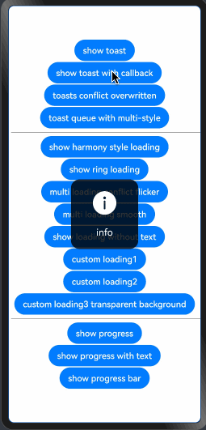

### 5.3. Loading
- XTPromptHUD
```typescript
/// 在windowStage.loadContent后或者组件声明周期内执行初始化
XTPromptHUD.globalConfigLoading(windowStage.getMainWindowSync().getUIContext(), (options: XTHUDLoadingOptions) => {
  options.isModal = true
})

XTPromptHUD.showLoading('加载中...')
setTimeout(() => {
  XTPromptHUD.hideLoading()
}, 3000)
```
- XTEasyHUD
```typescript
// 全局自定义配置，可选，如果需要，建议在全局入口 page 处配置
XTEasyHUD.globalConfigLoading((options: XTHUDLoadingOptions) => {
  options.maskColor = '#33000000' // 设置蒙层颜色
  options.closeOnClickOutside = false
  options.closeOnPressBack = false
})

XTEasyHUD.showLoading('加载中...')
setTimeout(() => {
  XTEasyHUD.hideLoading()
}, 3000)
```

- XTHUD
```typescript
// 建议在全局入口 page 处挂载全局唯一实例
// loading组件挂载，可以不做任何配置
XTHUDLoading()
// 或者，也可以做自定义全局样式，修改默认样式
XTHUDLoading({
  globalOptions: (options: XTHUDLoadingOptions) => {
    options.maskColor = '#33000000'
  }
})
        
// 简单用法，复杂用法见Demo部分        
XTHUDManager.showLoading('加载中...')
setTimeout(() => {
  XTHUDManager.hideLoading()
}, 3000)
```
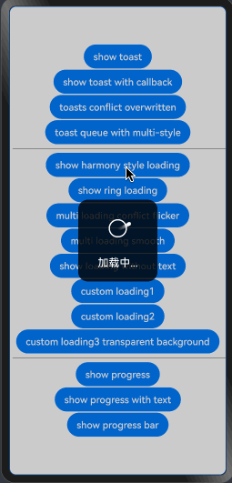
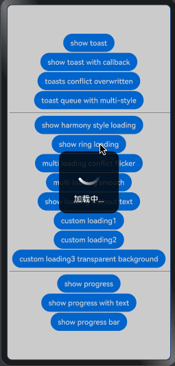
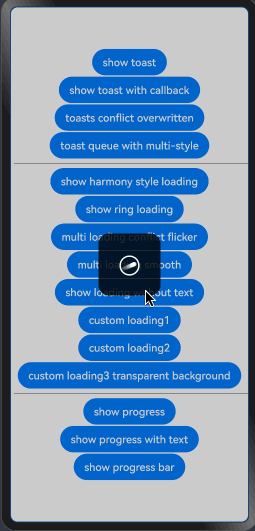
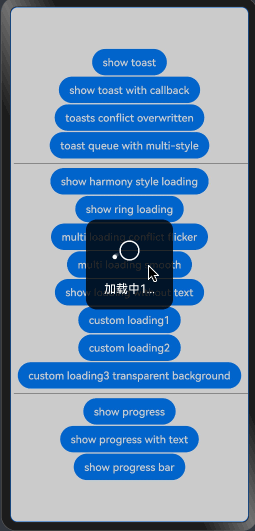
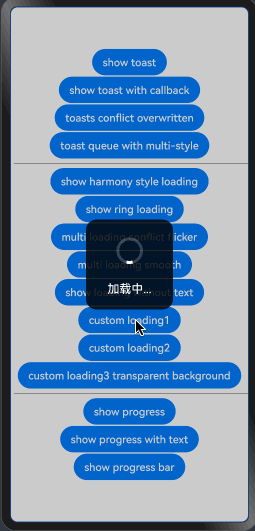

### 5.4. Progress
- XTPromptHUD
```typescript
/// 在windowStage.loadContent后或者组件声明周期内执行初始化
XTPromptHUD.globalConfigProgress(windowStage.getMainWindowSync().getUIContext(), (options: XTHUDProgressOptions) => {
  options.isModal = true
})

this.progress = 0
this.interval = setInterval(() => {
  this.progress ++
  XTPromptHUD.showProgress(this.progress)
  if (this.progress >= 100) {
    clearInterval(this.interval)
    this.interval = null
  }
}, 100)
```
- XTEasyHUD
```typescript
// 全局自定义配置，可选，如果需要，建议在全局入口 page 处配置
XTEasyHUD.globalConfigProgress((options: XTHUDProgressOptions) => {
  options.strokeWidth = 8
  options.closeOnClickOutside = false
  options.closeOnPressBack = false
})

this.progress = 0
this.interval = setInterval(() => {
  this.progress ++
  XTEasyHUD.showProgress(this.progress)
  if (this.progress >= 100) {
    clearInterval(this.interval)
    this.interval = null
  }
}, 100)
```

- XTHUD
```typescript
// 建议在全局入口 page 处挂载全局唯一实例
// progress组件挂载，可以不做任何配置
XTHUDProgress()
// 或者，也可以做自定义全局样式，修改默认样式
XTHUDProgress({
  globalOptions: (options: XTHUDProgressOptions) => {
    options.strokeWidth = 6
  }
})

// 简单用法，复杂用法见Demo部分
this.progress = 0
this.interval = setInterval(() => {
  this.progress ++
  XTHUDManager.showProgress(this.progress)
  if (this.progress >= 100) {
    clearInterval(this.interval)
    this.interval = null
  }
}, 100)
```
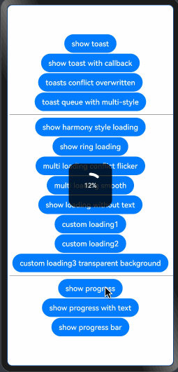
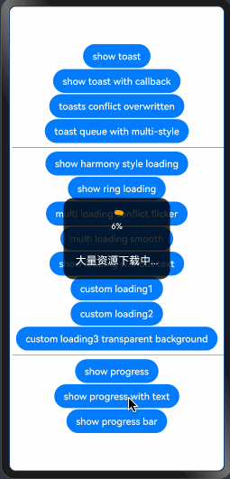

### 5.5. XTHUDManager Demo
```typescript
import { XTHUDManager } from '@jxt/xt_hud'
import {
  XTHUDToastOptions,
  XTHUDLoadingOptions,
  XTHUDProgressOptions,
  XTHUDToast,
  XTHUDLoading,
  XTHUDProgress
} from '@jxt/xt_hud'

@Entry
@Component
struct XTDemo {
  private scroller: Scroller = new Scroller()
  private progress: number = 0
  private interval: number | null = null

  build() {
    Scroll(this.scroller) {
      Column({ space: 2 }) {
        // toast组件挂载，可以不做任何配置
        // XTHUDToast()
        XTHUDToast({
          globalOptions: (options: XTHUDToastOptions) => {
            options.isQueueMode = false
            options.hidingDelay = 1000
            options.isModal = false
            options.alignment = DialogAlignment.Center
          }
        })

        // XTHUDLoading()
        XTHUDLoading({
          globalOptions: (options: XTHUDLoadingOptions) => {
            // options.iconSize = {width: 100, height: 100}
            options.maskColor = '#33000000'
          }
        })

        // XTHUDProgress()
        XTHUDProgress({
          globalOptions: (options: XTHUDProgressOptions) => {
            // options.iconSize = {width: 100, height: 100}
            // options.fontSize = 25
            // options.progressFontSize = 20
            options.strokeWidth = 6
          }
        })


        Button('show toast')
          .onClick(() => {
            XTHUDManager.showToast('toast', {
              onCompletion: () => {
                console.log('正常结束')
              },
              onCancel: () => {
                console.log('提前结束')
              }
            })
            setTimeout(() => {
              XTHUDManager.hideToast()
            }, 3000)
          })


        Button('show toast with callback')
          .onClick(() => {
            XTHUDManager.showToast('新的文本新的文本新的文本新的文本新的文本新的文本新的文本新的文本', {
              backgroundColor: '#CC0000FF',
              borderRadius: 5,
              onCancel: () => {
                console.log('cancel1')
              },
              onCompletion: () => {
                console.log('complete1')
                XTHUDManager.showInfo('info', {
                  onCancel: () => {
                    console.log('cancel2')
                  },
                  onCompletion: () => {
                    console.log('complete2')
                  }
                })
              }
            })
          })
        Button('toasts conflict overwritten')
          .onClick(() => {
            XTHUDManager.showInfo('info1')
            XTHUDManager.showError('info2')
            XTHUDManager.showSuccess('info3')
            setTimeout(() => {
              XTHUDManager.hideAllToast()
            }, 1000)
          })
        Button('toast queue with multi-style')
          .onClick(() => {
            XTHUDManager.showInfo('信息弹窗info', {
              isQueueMode: true,
              fontSize: 22,
              textColor: Color.Yellow,
              hidingDelay: 1000,
              onCompletion: () => {
                console.log('信息弹窗info 正常关闭')
              },
              onCancel: () => {
                console.log('信息弹窗info 被返回关闭')
              }
            })
            XTHUDManager.showWarning('警告弹窗warning警告弹窗warning', {
              isQueueMode: true,
              tintColor: Color.Orange,
              hidingDelay: 1500,
              backgroundColor: Color.Green,
              onCompletion: () => {
                console.log('警告弹窗warning 正常关闭')
              },
              onCancel: () => {
                console.log('警告弹窗warning 被返回关闭')
              }
            })
            XTHUDManager.showSuccess('成功弹窗\nsuccess', {
              isQueueMode: true,
              tintColor: Color.Green,
              textColor: Color.Black,
              hidingDelay: 2000,
              backgroundColor: '#E600FF00',
              borderRadius: 5,
              onCompletion: () => {
                console.log('成功弹窗 正常关闭')
              },
              onCancel: () => {
                console.log('成功弹窗 被返回关闭')
              }
            })
            XTHUDManager.showError('错误弹窗 错误弹窗 错误弹窗 错误弹窗', {
              isQueueMode: true,
              tintColor: Color.Red,
              backgroundColor: '#80FF0000',
              iconSize: { width: 150, height: 100 },
              onCompletion: () => {
                console.log('错误弹窗 正常关闭')
              },
              onCancel: () => {
                console.log('错误弹窗 被返回关闭')
              }
            })
          })


        Divider()
          .vertical(false)
          .width('100%')
          .color(Color.Black)
          .strokeWidth(0.5)
          .margin(5)


        Button('show harmony style loading')
          .onClick(() => {
            XTHUDManager.showLoading('加载中...')
            setTimeout(() => {
              XTHUDManager.hideLoading()
            }, 3000)
          })
        Button('show ring loading')
          .onClick(() => {
            XTHUDManager.showRingLoading()
            XTHUDManager.showRingLoading('加载中...', {
              strokeWidth: 6,
              onCompletion: () => {
                console.log('Ring loading complete')
              },
              onCancel: () => {
                console.log('Ring loading canceled')
              }
            })
            setTimeout(() => {
              XTHUDManager.hideAllLoading()
            }, 3000)
          })
        Button('multi loading conflict flicker')
          .onClick(() => {
            XTHUDManager.showLoading('加载中1...')
            setTimeout(() => {
              XTHUDManager.hideLoading()
              XTHUDManager.showLoading('加载中2...')
              setTimeout(() => {
                XTHUDManager.hideLoading()
              }, 2000)
            }, 1000)
          })
        Button('multi loading smooth')
          .onClick(() => {
            XTHUDManager.showLoading('加载中1...')
            setTimeout(() => {
              XTHUDManager.showLoading('加载中2...')
              setTimeout(() => {
                XTHUDManager.showLoading('加载中3...')
                setTimeout(() => {
                  XTHUDManager.hideAllLoading()
                }, 1000)
              }, 1000)
            }, 1000)
          })
        Button('show loading without text')
          .onClick(() => {
            // XTHUDManager.showLoading('', {
            //   borderRadius: 10,
            //   tintColor: Color.Yellow
            // })
            XTHUDManager.showLoading()
            setTimeout(() => {
              XTHUDManager.hideLoading()
            }, 3000)
          })
        Button('custom loading1')
          .onClick(() => {
            XTHUDManager.showCustomLoading(
              $r("app.media.loading1"),
              '加载中...'
            )
            setTimeout(() => {
              XTHUDManager.hideLoading()
            }, 3000)
          })
        Button('custom loading2')
          .onClick(() => {
            XTHUDManager.showCustomLoading(
              $r('app.media.loading5')
            )
            setTimeout(() => {
              XTHUDManager.hideLoading()
            }, 3000)
          })
        Button('custom loading3 transparent background')
          .onClick(() => {
            XTHUDManager.showCustomLoading(
              $r('app.media.loading5'),
              '',
              {
                backgroundColor: Color.Transparent,
                tintColor: Color.Pink,
                onCompletion: () => {
                  console.log('custom loading3 completed')
                },
                onCancel: () => {
                  console.log('custom loading3 cancelled')
                }
              }
            )
            setTimeout(() => {
              XTHUDManager.hideLoading()
            }, 3000)
          })


        Divider()
          .vertical(false)
          .width('100%')
          .color(Color.Black)
          .strokeWidth(0.5)
          .margin(5)


        Button('show progress')
          .onClick(() => {
            this.progress = 0
            this.interval = setInterval(() => {
              this.progress ++
              XTHUDManager.showProgress(this.progress)
              if (this.progress >= 100) {
                clearInterval(this.interval)
                this.interval = null
              }
            }, 100)
          })
        Button('show progress with text')
          .onClick(() => {
            this.progress = 0
            this.interval = setInterval(() => {
              this.progress ++
              XTHUDManager.showProgress(this.progress, '大量资源下载中...', {
                strokeWidth: 8,
                tintColor: Color.Orange,
                onCompletion: () => {
                  console.log('结束', this.progress)
                },
                onCancel: () => {
                  console.log('取消一次', this.progress)
                }
              })
              if (this.progress >= 100) {
                clearInterval(this.interval)
                this.interval = null
              }
            }, 200)
          })
        Button('show progress bar')
          .onClick(() => {
            this.progress = 0
            this.interval = setInterval(() => {
              this.progress ++
              XTHUDManager.showBarProgress(this.progress, '大量资源下载中: ', {
                strokeWidth: 8,
                tintColor: Color.Orange
              })
              if (this.progress >= 100) {
                clearInterval(this.interval)
                this.interval = null
              }
            }, 100)
          })
      }
      .width('100%')
    }
    .height('100%')
    .scrollable(ScrollDirection.Vertical)
    .scrollBar(BarState.On)  // 滚动条常驻显示
  }
}
```

### 5.6. XTEasyHUD Demo
```typescript
import {
  XTEasyHUD,
  XTHUDToastOptions,
  XTHUDLoadingOptions,
  XTHUDProgressOptions
} from '@jxt/xt_hud'

@Entry
@Component
struct XTEasyDemo {

  private progress: number = 0
  private interval: number | null = null

  aboutToAppear(): void {
    XTEasyHUD.globalConfigToast((options: XTHUDToastOptions) => {
      options.isQueueMode = true // 开启toast队列模式
      options.hidingDelay = 1000
      options.isModal = false
      options.openAnimation = {
        // duration: 200,
        tempo: 0 // 关闭开启动画
      }
      options.closeAnimation = {
        duration: 100,
        // tempo: 0
      }
    })
    XTEasyHUD.globalConfigLoading((options: XTHUDLoadingOptions) => {
      options.maskColor = '#33000000' // 设置蒙层颜色
    })
    XTEasyHUD.globalConfigProgress((options: XTHUDProgressOptions) => {
      options.strokeWidth = 8
    })
  }

  build() {
    Column({ space: 2 }) {
      Button('show toast')
        .onClick(() => {
          XTEasyHUD.showToast('toast')
        })

      Button('show toast with callback')
        .onClick(() => {
          XTEasyHUD.showToast('toast', {
            onCompletion: () => {
              console.log('正常结束')
            },
            onCancel: () => {
              console.log('提前结束')
            }
          })
        })

      Button('show toast queue')
        .onClick(() => {
          XTEasyHUD.showToast('toast')
          XTEasyHUD.showInfo('信息弹窗info', {
            fontSize: 22,
            textColor: Color.Yellow,
            onCompletion: () => {
              console.log('信息弹窗info 正常关闭')
            },
            onCancel: () => {
              console.log('信息弹窗info 被返回关闭')
            }
          })
          XTEasyHUD.showWarning('警告弹窗warning警告弹窗warning', {
            tintColor: Color.Orange,
            hidingDelay: 1500,
            onCompletion: () => {
              console.log('警告弹窗warning 正常关闭')
            },
            onCancel: () => {
              console.log('警告弹窗warning 被返回关闭')
            }
          })
          XTEasyHUD.showSuccess('成功弹窗\nsuccess', {
            tintColor: Color.Green,
            hidingDelay: 2000,
            onCompletion: () => {
              console.log('成功弹窗 正常关闭')
            },
            onCancel: () => {
              console.log('成功弹窗 被返回关闭')
            }
          })
          XTEasyHUD.showError('错误弹窗 错误弹窗 错误弹窗 错误弹窗', {
            tintColor: Color.Red,
            iconSize: { width: 150, height: 100 },
            onCompletion: () => {
              console.log('错误弹窗 正常关闭')
            },
            onCancel: () => {
              console.log('错误弹窗 被返回关闭')
            }
          })
        })

      Divider()
        .vertical(false)
        .width('100%')
        .color(Color.Black)
        .strokeWidth(0.5)
        .margin(5)

      Button('show loading')
        .onClick(() => {
          XTEasyHUD.showLoading('加载中...')
          setTimeout(() => {
            XTEasyHUD.hideLoading()
          }, 3000)
        })
      Button('show ring loading')
        .onClick(() => {
          XTEasyHUD.showRingLoading('加载中...', {
            onCompletion: () => {
              console.log('Ring loading complete')
            },
            onCancel: () => {
              console.log('Ring loading canceled')
            }
          })
          setTimeout(() => {
            XTEasyHUD.hideAllLoading()
          }, 3000)
        })
      Button('multi loading conflict flicker')
        .onClick(() => {
          XTEasyHUD.showLoading('加载中1...')
          setTimeout(() => {
            XTEasyHUD.hideLoading()
            XTEasyHUD.showLoading('加载中22...')
            setTimeout(() => {
              XTEasyHUD.hideLoading()
              XTEasyHUD.showLoading('加载中333...')
              setTimeout(() => {
                XTEasyHUD.hideLoading()
              }, 2000)
            }, 2000)
          }, 1000)
        })
      Button('multi loading smooth')
        .onClick(() => {
          XTEasyHUD.showLoading('加载中1...')
          setTimeout(() => {
            XTEasyHUD.showLoading('加载中22...', {
              fontSize: 20,
              iconSize: { width: 60, height: 60 },
              tintColor: Color.Red,
              textColor: Color.Red
            })
            setTimeout(() => {
              XTEasyHUD.showLoading('加载中333...', {
                fontSize: 24,
                iconSize: { width: 100, height: 100 },
                tintColor: Color.Yellow,
                textColor: Color.Yellow
              })
              setTimeout(() => {
                XTEasyHUD.hideAllLoading()
              }, 1000)
            }, 1000)
          }, 1000)
        })
      Button('show loading without text')
        .onClick(() => {
          XTEasyHUD.showRingLoading()
          setTimeout(() => {
            XTEasyHUD.hideLoading()
          }, 3000)
        })
      Button('show loading without background')
        .onClick(() => {
          XTEasyHUD.showLoading('', {
            backgroundColor: Color.Transparent,
            tintColor: Color.Orange,
            iconSize: { width:100, height:100 }
          })
          setTimeout(() => {
            XTEasyHUD.hideLoading()
          }, 3000)
        })

      Divider()
        .vertical(false)
        .width('100%')
        .color(Color.Black)
        .strokeWidth(0.5)
        .margin(5)

      Button('show progress')
        .onClick(() => {
          this.progress = 0
          this.interval = setInterval(() => {
            this.progress ++
            XTEasyHUD.showProgress(this.progress)
            if (this.progress >= 100) {
              clearInterval(this.interval)
              this.interval = null
            }
          }, 100)
        })
      Button('show progress with text')
        .onClick(() => {
          this.progress = 0
          this.interval = setInterval(() => {
            this.progress ++
            XTEasyHUD.showProgress(this.progress, `大量资源下载中: ${this.progress}%`, {
              strokeWidth: 8,
              tintColor: Color.Orange,
              onCompletion: () => {
                console.log('结束', this.progress)
              },
              onCancel: () => {
                console.log('取消一次', this.progress)
              }
            })
            if (this.progress >= 100) {
              clearInterval(this.interval)
              this.interval = null
            }
          }, 200)
        })
      Button('show progress bar')
        .onClick(() => {
          this.progress = 0
          this.interval = setInterval(() => {
            this.progress ++
            XTEasyHUD.showBarProgress(this.progress, '大量资源下载中: ', {
              strokeWidth: 8,
              tintColor: Color.Orange
            })
            if (this.progress >= 100) {
              clearInterval(this.interval)
              this.interval = null
            }
          }, 100)
        })
      Button('show progress bar 2')
        .onClick(() => {
          this.progress = 0
          this.interval = setInterval(() => {
            this.progress ++
            XTEasyHUD.showBarProgress(this.progress, '', {
              strokeWidth: 8,
              tintColor: Color.Orange
            })
            if (this.progress >= 100) {
              clearInterval(this.interval)
              this.interval = null
            }
          }, 100)
        })
    }
    .width('100%')
    .height('100%')
  }
}
```