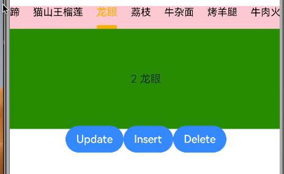

# PJTabBar

## 简介
PJTabBar是一个用于替换系统Tabs的控件，支持自定义指示器，Tabbar item, Tabbar item的布局(居左居中居右), Tabbar的左右附加额外视图等


## 效果展示:

**指示器联动**


**自定义指示器:**


**自定义Tabbar Item:**


**自定义Item的布局:**


**自定义Tabbar左右的附加视图:**


**更新插入删除自定义Tabbar Item:**




## 下载安装

````
ohpm install @piaojin/pjtabbar
````

OpenHarmony ohpm环境配置等更多内容，请参考[如何安装OpenHarmony ohpm包](https://gitee.com/openharmony-tpc/docs/blob/master/OpenHarmony_har_usage.md)

## 使用说明

可通过PJTabBarOptions自定义指示器视图，大小，间距，布局，样式等，也可自定义Tabbar Item视图， 左右附加视图等。并支持更新，添加，删除Tabbar Item。

````

1. 导入
import {PJTabComponent, PJTabBarItem, PJTabBarOptionsInterface, PJTabBarOptions} from '@ohos/pjtabbar'
(根据需要可导入PJTabBar，PJTabComponentController, PJTabBarOptions等)

2. PJTabComponent作为Tabs + TabContent使用，也可以单独使用不带Tab content的PJTabBar。

private options: PJTabBarOptionsInterface = new PJTabBarOptions()
this.options.indicatorWidth = 30
this.options.indicatorHeight = 6
this.options.indicatorColor= Color.Orange
this.options.tabBarBackGround = Color.Pink
this.options.selectedFontSize = 16
this.options.selectedFontColor = Color.Orange
this.options.tabBarContentMargin = {left: 10, right: 10}

PJTabComponent({
   items: this.items,
   tabBarOptions: this.options,
   // 注意contentBuilder的传值方式，这种方式下contentBuilder中的this才是正确的。
   contentBuilder: (item: PJTabBarItemInterface, index: number) => {
       this.contentBuilder(item, index)
   },
})

@Builder contentBuilder(item: PJTabBarItemInterface, index: number) {
   Text(index.toString() + ' ' + item.title)
    .width('100%')
    .height('100%')
    .textAlign(TextAlign.Center)
    .backgroundColor(Color.Green)
}
````

### 设置指示器滚动效果
目前支持联动和普通滚动
<font face="微软雅黑" size=3 color=#00ff66 >this.options.indicatorAnimationType = PJIndicatorAnimationType.Linkage</font>

<font face="微软雅黑" size=5 color=#FF0000 >注意:</font>

#### 1. ```contentBuilder```的传值方式，这种方式下```contentBuilder```中的```this```才是正确的， 通过this才能正确的访问到当前调用者的属性。```customerItemBuilder```, ```customerIndicatorBuilder```, ```leftItemBuilder```和```rightItemBuilder```等Builder类似。
````
PJTabComponent({
   items: this.items,
   tabBarOptions: this.options,
   // 注意contentBuilder的传值方式，这种方式下contentBuilder中的this才是正确的。
   contentBuilder: ($$: PJReferenceTabBarItemInterface) => {
       this.contentBuilder($$)
   },
   // 这种调用方式下this不是指向当前的调用者，没法通过this访问当前调用者的属性
   // contentBuilder: this.contentBuilder
})
````

#### 2. 当```contentBuilder```中的组件用到```PJTabBarItem的title/selectedItemIndex```等属性时，并且希望当调用```controller```的```update```操作后该组件的```title/selectedItemIndex```能跟着更新，那么```contentBuilder```的内容需要封装到一个子组件中，例如```PJContentBuilderWrap```。并且```PJContentBuilderWrap```需要以 
````
@State(也可采用@ObjectLink) item: PJTabBarItemInterface = {id: '', index: 0, title: '' }
currentItemIndex: number = 0
@Link selectedItemIndex: number
````
的形式绑定数据。这么做的原因是当数据源从```PJTabComponent```中通过```@Builder```函数引用传递到调用者的```contentBuilder```时，需要通过```@State/@ObjectLink/@Link```等关键词才能绑定数据源，并且组件的UI才能跟着数据的变化而变化。```customerItemBuilder```, ```customerIndicatorBuilder```, ```leftItemBuilder```和```rightItemBuilder```等Builder类似。
详细原因可参考官方文档: [@Builder装饰器: 按引用传递参数](https://developer.huawei.com/consumer/cn/doc/harmonyos-guides-V2/arkts-builder-0000001524176981-V2#section1522464044212) 与 [管理组件拥有的状态](https://developer.huawei.com/consumer/cn/doc/harmonyos-guides-V2/arkts-component-state-management-0000001524417205-V2)

````
// 子组件
@Component
struct PJContentBuilderWrap {
  @State item: PJTabBarItemInterface = {id: '', index: 0, title: '' }
  currentItemIndex: number = 0
  @Link selectedItemIndex: number

  build() {
    Column() {
      Text(this.currentItemIndex + ' ' + this.item.title + ', ' + this.selectedItemIndex)
        .width('100%')
        .height('100%')
        .textAlign(TextAlign.Center)
        .backgroundColor(Color.Green)
    }
  }
}

// 调用者的contentBuilder函数
@Builder contentBuilder($$: PJReferenceTabBarItemInterface, self: CRUDItemPage) {
   PJContentBuilderWrap({currentItemIndex: $$.currentItemIndex, selectedItemIndex: $$.selectedItemIndex, item: $$.item})

   // 当content中的组件用到PJTabBarItem的title时，并且不需要随着controller的update操作后该组件的title能跟着更新，那么可以不需要将contentBuilder的内容包装在一个组件中， 如下。
   // Text($$.currentItemIndex + ' ' + $$.item.title + ', ' + $$.selectedItemIndex)
   //   .width('100%')
   //   .height('100%')
   //   .textAlign(TextAlign.Center)
   //   .backgroundColor(Color.Green)
 }
````

#### 3. 当```contentBuilder```中的组件用到```PJTabBarItem的title/selectedItemIndex```时，并且不需要随着```controller```的```update```操作后该组件的```title/selectedItemIndex```能跟着更新，那么可不需要将```contentBuilde```的内容包装在一个组件中。

#### 4. 当需要更新/删除/添加`item`时需要使用`PJTabComponentController`提供的接口。
````
  /**
   * Update the item with `item` at `atIndex`.
   * @param atIndex Index of the item to be updated.
   * @param item The new item used to update the current item at `atIndex`.
   */
  update(index: number, item: PJTabBarItemInterface);

  /**
   * Appends new elements to the end of an array, and returns the new length of the array.
   * @param items New elements to add to the array.
   */
  push(...items: PJTabBarItemInterface[]): number;

  /**
   * Insert the new item at `atIndex`.
   * @param atIndex Index of the new item to be inserted.
   * @param item The new item used to insert at `atIndex`.
   */
  insert(atIndex: number, item: PJTabBarItemInterface);

  /**
   * Delete the item at `atIndex`.
   * @param atIndex Delete the item at `atIndex` and return the deleted item. And return null if the `atIndex` is out of range.
   */
  delete(atIndex: number): PJTabBarItemInterface | null;

  /**
   * Replace current items with `withItems` and select item at `selectIndex`.
   * @param withItems Used to replace current items.
   * @param selectIndex If provided, will select the item at `selectIndex`. If it is not provided, the current index is used instead.
   */
  setItems(withItems: PJTabBarItemInterface[], selectIndex: number = this.currentIndex());
  
  let controller = PJTabComponentController()
  
  PJTabComponent({
     index: 0,
     items: this.items,
     controller: this.controller,
     tabBarOptions: this.options,
     contentBuilder: ($$: PJReferenceTabBarItemInterface) => {
        this.contentBuilder($$, this)
     }
   })
   
  controller.update(0, new PJTabBarItem("更新Item"))
````

更多详细用法请参考开源库sample页面的实现

## PJTabBarOptions属性说明

| <font face="黑体" size=4>属性名</font>                                                                          |                                                                                                                                                                                                                                                    <font face="黑体" size=4>说明</font> |
|:-----------------------------------------------------------------------------------------------------------|------------------------------------------------------------------------------------------------------------------------------------------------------------------------------------------------------------------------------------------------------------------------------------:|
| `fontSize: number`                                                                                         |                                                                                                                                                                                                                                                               item未选中状态下的字体大小,默认值15 |
| `selectedFontSize?: number`                                                                                |                                                                                                                                                                                                                                                                item选中状态下的字体大小,默认值15 |
| `fontColor: Color`                                                                                         |                                                                                                                                                                                                                                                      item未选中状态下的字体颜色，默认值Color.Black |
| `selectedFontColor: Color`                                                                                 |                                                                                                                                                                                                                                                        item选中状态下的字体颜色，默认值Color.Blue |
| `fontWeight: number ? FontWeight ? string`                                                                 |                                                                                                                                                                                                                                          item未选中状态下的字体Weight, 默认值FontWeight.Regular |
| `selectedFontWeight: number ? FontWeight ? string`                                                         |                                                                                                                                                                                                                                           item选中状态下的字体Weight, 默认值FontWeight.Regular |
| `fontStyle: FontStyle`                                                                                     |                                                                                                                                                                                                                                             item未选中状态下的字体Style, 默认值FontStyle.Normal |
| `selectedFontStyle: FontStyle`                                                                             |                                                                                                                                                                                                                                              item选中状态下的字体Style, 默认值FontStyle.Normal |
| `fontFamily: string ？ Resource`                                                                            |                                                                                                                                                                                                                                                              item字体的Family, 默认值为空'' |
| `textAlign: TextAlign = TextAlign.Center`                                                                  |                                                                                                                                                                                                                                                  item text对齐方式, 默认值TextAlign.Center |
| `itemBackgroundColor: Color`                                                                               |                                                                                                                                                                                                                                               item未选中状态下的背景颜色, 默认值Color.Transparent |
| `selectedItemBackgroundColor: Color`                                                                       |                                                                                                                                                                                                                                                item选中状态下的背景颜色, 默认值Color.Transparent |
| `tabBarBackGround: Color = Color.White`                                                                    |                                                                                                                                                                                                                                                        整个TabBar的背景颜色，默认值Color.White |
| `itemSpace: number`                                                                                        |                                                                                                                                                                                                                                                                 每个item之间的间距,默认值20vp |
| `itemWidth?: number`                                                                                       |                                                                                                                                                                                                                                      每个item的固定宽度，默认值为null。如果未设置则item的宽度由item内容自适应宽度 |
| `itemHeight?: number`                                                                                      |                                                                                                                                                                                                                                      每个item的固定高度，默认值为null。如果未设置则item的高度由item内容自适应高度 |
| `itemBorder: BorderOptions`                                                                                |                                                                                                                                                                                                                      item未选中状态下的border,默认值{radius: 0, width: 0, color: Color.White} |
| `selectedItemBorder: BorderOptions`                                                                        |                                                                                                                                                                                                                      item未选中状态下的border,默认值{radius: 0, width: 0, color: Color.White} |
| `itemMargin?: Margin`                                                                                      |                                                                                                                                                                                                                               item的Margin,默认值{top: 0, bottom: 0, left: 0, right: 0} |
| `itemPadding?: Padding`                                                                                    |                                                                                                                                                                                                                              item的Padding,默认值{top: 0, bottom: 0, left: 0, right: 0} |
| `itemAnimationDuration: number`                                                                            |                                                                                                                                                                                                                                                     TabBar滚动到被选中的item的动画持续时间，默认值300 |
| `itemAlign: Alignment`                                                                                     |                                                                                                                                                                                              item在TabBar中水平位置的对齐方式(居左居中居右)，需要设置`isTabBarWidthFillParent = true`，默认值Alignment.Center |
| `itemEqualDistributionType: PJItemEqualDistributionType`                                                   |                                                                                                                                                                                          Item均分布局类型，默认值PJItemEqualDistributionType.None，即不均分布局。需要注意的是只有Item的总长度在PJTabBar宽度以内时均分才适用。 |
| `tabBarVerticalAlign?: VerticalAlign`                                                                      |                                                                                                                                                                                                                                  item在TabBar中垂直方向的对齐方式(居上居中居下)，默认值VerticalAlign.Top |
| `maxLines: number`                                                                                         |                                                                                                                                                                                                                                                                 item text的最大行数,默认值1 |
| `indicatorWidth: number`                                                                                   |                                                                                                                                                                                                                                                                         指示器宽度，默认值20 |
| `indicatorHeight: number`                                                                                  |                                                                                                                                                                                                                                                                          指示器高度，默认值4 |
 | `indicatorBorderRadius: number`                                                                            |                                                                                                                                                                                                                                                                          指示器圆角，默认值2 |
| `indicatorMargin: Margin`                                                                                  |                                                                                                                                                                                                                                指示器Margin,默认值{top: 10, bottom: 0, left: 0, right: 0} |
| `indicatorColor: Color`                                                                                    |                                                                                                                                                                                                                                                                 指示器颜色，默认值Color.Blue |
| `indicatorAnimationDuration: number`                                                                       |                                                                                                                                                                                                                                                          指示器滚动到选中item的动画持续时间，默认值300 |
| `indicatorPosition: PJIndicatorPosition`                                                                   |                                                                                                                                                                                                                              指示器在item的位置(在item上，下，中间)，默认值PJIndicatorPosition.Bottom |
| `indicatorAnimationType: PJIndicatorAnimationType = PJIndicatorAnimationType.Normal`                       |                                                                                                                                                                                         指示器滚动的风格，目前有Normal和Linkpage。Normal, 即当选中其他item时指示器在选中后才滚动过去。 Linkpage,指示器和tab content滑动时联动。 |
| `isSameWidthWithItem: boolean`                                                                             |                                                                                                                                                                                                                   设置指示器的宽度是否和item宽度一致，默认值false, 如果设置为true则对`indicatorWidth`属性的设置将无效 |
| `isSameHeightWithItem: boolean`                                                                            |                                                                                                                                                                                                                  设置指示器的高度是否和item高度一致，默认值false, 如果设置为true则对`indicatorHeight`属性的设置将无效 |
| `isHideIndicator: boolean`                                                                                 |                                                                                                                                                                                                                                                                    是否隐藏指示器，默认值false |
| `scrollable: ScrollDirection`                                                                              |                                                                                                                                                                                                                TabBar滚动方向，设置为None时禁止滚动，即固定TabBar Item，默认值ScrollDirection.Horizontal |
| `isLeftItemFixed: boolean`                                                                                 |                                                                                                                                                                                                                                                           TabBar左侧附加视图是否固定住，默认值true |
| `isRightItemFixed: boolean`                                                                                |                                                                                                                                                                                                                                                           TabBar右侧附加视图是否固定住，默认值true |
| `isLeftItemSameHeightWithTabBar: boolean`                                                                  |                                                                                                                                                                                                                                                   TabBar左侧附加视图高度是否和TabBar一致，默认值true |
| `isRightItemSameHeightWithTabBar: boolean`                                                                 |                                                                                                                                                                                                                                                   TabBar右侧附加视图高度是否和TabBar一致，默认值true |
| `isHideLeftItem: boolean`                                                                                  |                                                                                                                                                                                                                                                           是否隐藏TabBar左侧附加视图，默认值false |
| `isHideRightItem: boolean`                                                                                 |                                                                                                                                                                                                                                                           是否隐藏TabBar右侧附加视图，默认值false |
| `tabBarEdgeEffect: EdgeEffect`                                                                             |                                                                                                                                                                                                                                               TabBar滚动到边缘的动画效果，默认值EdgeEffect.Spring |
| `tabContentEdgeEffect?: EdgeEffect`                                                                        |                                                                                                                                                                                                                                        TabBarContent滚动到边缘的动画效果，默认值EdgeEffect.Spring |
 | `tabBarContentMargin: Margin`                                                                              |                                                                                                                                                                                                                           TabBar内容的Margin,默认值{top: 0, bottom: 0, left: 0, right: 0} |
| `isTabBarWidthFillParent?: boolean`                                                                        |                                                                                                                               TabBar宽度是否撑满父组件，默认值true。当设置true时`itemAlign`属性不起作用(居左居中居右)，此时TabBar宽度是自适应的，若单独使用PJTabBar可自行配合`Row() {PJTabBar}.justifyContent(FlexAlign)`达到居左，居中，居右效果。 |
| `shouldScrollToCurrentIndexWhenTabBarWidthChanged?: boolean`                                               |                                                                                                                                                                                                                              TabBar宽度变化后(比如横竖屏切换)当选中的item不可见时是否自动滚动到选中的item，默认值true |
| `optimizeOffsetX: number`                                                                                  |                                                                                                                                                                                                                                  item被选中时滚动到item的附加偏移量，目的是让被选中的item尽量滚动到中间位置，默认值120 |
| `tabBarBorder?: BorderOptions`                                                                             |                                                                                                                                                                                                                                        TabBar border配置，默认值null, 可用于配置iOS风格Segment组件 |
| `tabBarHeight?: number`                                                                                    |                                                                                                                                                                                                                                             tabbar的高度，默认值null，即默认由item内容撑开tabbar高度。 |
| `tabsAnimationDuration: number`                                                                            |                                                                                                                                                                                                                                                    tab content切换page时的动画时长，默认值300毫秒 |
| `tabContentScrollable: boolean`                                                                            |                                                                                                                                                                                                                                                         控制tab content是否可以滑动，默认值true |
| `enableRecycling: boolean`                                                                                 | 是否启用页签回收功能， 默认值false。当有很多页签时，同时希望减少内存压力，那么设置`enableRecycling = true`。页签回收指当页签滑出屏幕外时，回收该页签内存以节省内存。回收时机依据`PJTabBarOptions`中的`cachedCount`属性值，e.g: cachedCount = 2, 页签有1，2，3，4，5，6，当页签1被滑动出去后并且当前滑动到页签4，此时页签1被回收, 页签2，3还在cache中(`cachedCount = 2`), 即`cachedCount`指可以被滑动出界面并且被缓存的页签数量。 |
| `cachedCount: number`                                                                                      |                                                                                                                                                                                                             设置预加载页签个数，即指可以被滑动出界面并且被缓存的页签数量，默认值1。该属性使用于`enableRecycling = true`的情况下。 |
| `disableSwipe: boolean`                                                                                    |                                                                                                                                                                                          禁用页签滑动切换功能，该属性使用于`enableRecycling = true`的情况下。`enableRecycling = false`时设置`scrollable`以替代。 |
| `displayArrow: [ArrowStyle                                                           \| boolean, boolean]` |                                                                                                                                                                                                                设置页签两侧的分页指示器, 默认值[false, false], 该属性使用于`enableRecycling = true`的情况下。 |
| `expandSafeArea: [types?: Array<SafeAreaType>, edges?: Array<SafeAreaEdge>]`                               |                                                                                                                                                  设置展开safe area, 默认值是[[SafeAreaType.SYSTEM], [SafeAreaEdge.BOTTOM]]，默认会展开到底部的safe area,注意需要在contentBuilder中设置`expandSafeArea`,才会起作用。 |

## ```PJTabComponentController```接口说明
| <font face="黑体" size=4>接口名</font>                                                                                                                                                 |                                                                                                     <font face="黑体" size=4>说明</font> |
|:----------------------------------------------------------------------------------------------------------------------------------------------------------------------------------|-------------------------------------------------------------------------------------------------------------------------------------:|
| `currentIndex(): number`                                                                                                                                                          |                                                                                                        返回当前选中的```item```的```index``` |
| `changeIndex(index: number)`                                                                                                                                                      |                                                                                                        控制```PJTabComponent```切换到指定页签 |
| `update(index: number, item: PJTabBarItemInterface)`                                                                                                                              |                                                                                       更新指定位置的```item```，当index不在items的range内时不做响应处理。 |
| `push(...items: PJTabBarItemInterface[]): number`                                                                                                                                 |                                                                                                                在TabBar末尾新增```item``` |
| `insert(atIndex: number, item: PJTabBarItemInterface)`                                                                                                                            |                                                                                       在指定位置插入```item```，当index不在items的range内时不做响应处理。 |
| `delete(atIndex: number): PJTabBarItemInterface \| null`                                                                                                                          |                                                                                        删除指定位置```item```，当index不在items的range内时不做响应处理。 |
| `setItems(withItems: PJTabBarItemInterface[], selectIndex: number = this.currentIndex())`                                                                                         |                                                                                                                      替换所有的```item``` |
| `findIndex(predicate: (value: PJTabBarItemInterface, index: number, obj: PJTabBarItemInterface[]) => boolean, thisArg?: undefined): number`                                       |                                                                                                       根据条件查找相应```item```的```index``` |
| `find(predicate: (value: PJTabBarItemInterface, index: number, obj: PJTabBarItemInterface[]) => boolean, thisArg?: undefined): PJTabBarItemInterface \| undefined `               |                                                                                                                      根据条件查找相应的`item` |
| `getItem(atIndex: number): PJTabBarItemInterface \| undefined`                                                                                                                    |                                                                                                                  返回`atIndex`处的`item` |
| `preloadItems(indices: Optional<Array<number>>): Promise<void>                                                                                                      \| undefined` |                                                                                                                     加载指定的tab content |
| `syncTabContentWidth(width: number)`                                                                                                                                              |                                                                      同步页签(tab content)的宽度，用于指示器联动时判断手势滑动距离的百分比，默认tab content是撑满屏幕宽度。 |

## ```PJTabBarController```接口说明
| <font face="黑体" size=4>接口名</font>                                                                                                                                                                                                                   |                                <font face="黑体" size=4>说明</font> |
|:----------------------------------------------------------------------------------------------------------------------------------------------------------------------------------------------------------------------------------------------------|----------------------------------------------------------------:|
| `currentIndex(): number`                                                                                                                                                                                                                            |                                   返回当前选中的```item```的```index``` |
| `selectItemAtIndex(index: number)`                                                                                                                                                                                                                  |                                      控制```PJTabBar```选中指定`item` |
| `update(index: number, item: PJTabBarItemInterface)`                                                                                                                                                                                                |                                               更新指定位置的```item``` |
| `push(...items: PJTabBarItemInterface[]): number`                                                                                                                                                                                                   |                                           在TabBar末尾新增```item``` |
| `insert(atIndex: number, item: PJTabBarItemInterface)`                                                                                                                                                                                              |                                               在指定位置插入```item``` |
| `delete(atIndex: number): PJTabBarItemInterface \| null`                                                                                                                                                                                            |                                                删除指定位置```item``` |
| `setItems(withItems: PJTabBarItemInterface[], selectIndex: number = this.currentIndex())`                                                                                                                                                           |                                                 替换所有的```item``` |
| `findIndex(predicate: (value: PJTabBarItemInterface, index: number, obj: PJTabBarItemInterface[]) => boolean, thisArg?: undefined): number`                                                                                                         |                                  根据条件查找相应```item```的```index``` |
| `find(predicate: (value: PJTabBarItemInterface, index: number, obj: PJTabBarItemInterface[]) => boolean, thisArg?: undefined): PJTabBarItemInterface \| undefined `                                                                                 |                                                 根据条件查找相应的`item` |
| `getItem(atIndex: number): PJTabBarItemInterface \| undefined`                                                                                                                                                                                      |                                             返回`atIndex`处的`item` |
| `syncTabContentWidth(width: number)`                                                                                                                                                                                                                | 同步页签(tab content)的宽度，用于指示器联动时判断手势滑动距离的百分比，默认tab content是撑满屏幕宽度。 |
| `handleTouch(event: TouchEvent, currentIndex: number, duration: number                                                                                              \| undefined)`                                                                  | 处理手势滑动tab content,使指示器跟着手势联动。|

## 约束与限制

在下述版本验证通过：

- DevEco Studio: NEXT Developer Beta2(Build Version: 5.0.3.502), SDK: API12(5.0.0)

## 目录结构

````
|---- PJTabBar
|     |---- entry  # 示例代码文件夹
|     |---- pjtabbar_staticlibrary  # PJTabBar三方库核心文件夹
|           |----src
|                 |----main
|                       |----ets
|                             |----components
|                                   |----PJTabBar.ets #指示器的核心实现
|                                   |----PJTabComponent.ets #供开发使用，等于Tabs + TabContent
|                                   |----PJTabBarItemComponent.ets #包装指示器的子组件
                              |----models
|                                   |----PJTabBarOptions.ets #包含各种配置项
|                                   |----其他.ets #其他model文件
                              |----datasources
|                                   |----PJTabDataSource.ets #对数据源的各种操作，比如update, insert, push, delete和setItems等。
|           |---- index.ets  # 对外接口
|     |---- README.md  # 安装使用方法
````

## 贡献代码

使用过程中发现任何问题都可以提 [Issue](https://gitee.com/weng-jinshan/PJTabBar/issues) 给我，当然，我也非常欢迎你给我发 [PR](https://gitee.com/weng-jinshan/PJTabBar/pulls) 。

## 开源协议

本项目基于 [Apache License 2.0](https://gitee.com/openharmony-sig/CircleIndicator/blob/master/LICENSE) ，请自由地享受和参与开源。

## 参考的ReadMe写法

[CircleIndicator README.md](https://gitee.com/openharmony-sig/CircleIndicator/blob/master/README.md)
