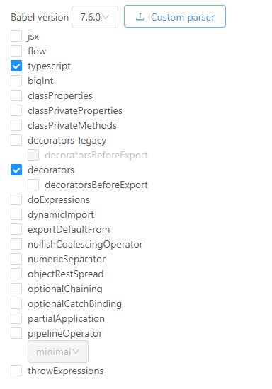

# 2026ICSE-ArkInsight
This repository illustrates the methods, data, and scripts of our ICSE 2026 under-reviewing work, Demystifying ArkTS Dependencies for OpenHarmony: A Static Analysis with Custom Parser.

We make our tool's benchmarks and all experimental results publicly available. Due to the file size limit of GitHub, we upload the processed data to this repository. 

## Directory Structure

The whole directory goes like the following:
```
├─README.md 
├─Scripts
├─Data
│  ├─RQ1 
│  │  ├─benchmark A
|  |  |  └─testcases
│  │  └─results      
│  │     ├─ArkAnalyzer
│  │     ├─ArkInsight
│  │     └─Similarity_Score
│  ├─RQ2
│  │  ├─benchmark B1
|  |  |  ├─entity
|  |  |  ├─explicit-dependency
|  |  |  └─README
│  │  └─results1      
│  │  |  ├─testcases
│  │  |  └─ArkInsight
│  │  ├─benchmark B2
│  │  │  └─implicit-dependency 
│  │  └─results2
│  │     ├─ArkAnalyzer
│  │     └─ArkInsight
│  ├─RQ3
│  │  ├─benchmark C
│  │  │  ├─projects
│  │  │  └─dependency
│  │  └─results
│  │     ├─ArkAnalyzer
│  │     └─ArkInsight
│  └─RQ4
|     ├─benchmark D
│     │  └─project_list.csv
│     └─results
│        ├─result_list.csv
│        └─result.png
|
└─Methods              

```

## Methods

This directory contains our executable programs and demos. Among them, `Arkbel-parser.js` and `ArkInsight.mjs` are packaged executable JS files. The `demo` includes three parts: the test project `ef_rcp` and the expected result output `expect_ef_rcp.json` for ArkInsight; and `demo.ets`, which is the test file for Arkbel.

### Requirements

- Operating System : Windows/Mac/Linux
- Node.js 16~20.

### Arkbel-parser.js

**Arkbel** is the parser for this work. It is used to provide the Abstract Syntax Tree (AST) and the corresponding traversal interface. For the convenience of user testing, we have packaged its syntax analysis functionality, hence that You can use websites below to view AST of a file conveniently:

> Online: https://lihautan.com/babel-ast-explorer/

You may open the settings, check the options as shown in the image, and then upload this file **Arkbel-parser.js** as **Cunstom parser**.



You can use the _demo.ets_ file as input to view it.

_TO_NOTICE_: Since this website unsupport some function including 'import' and 'export default', You may avoid this when input a file.

### ArkInsight.mjs

**ArkInsight** is the primary method discussed in this article, supporting static analysis of ArkTS code to extract its entity and dependency. To facilitate its use by testers, we have also packaged it and integrated the capabilities of Arkbel, resulting in the generation of an executable file, _ArkInsight.mjs_.

#### Usages

Append `-h` or `--help` without any other arguments to see list of options:

```text
Usage: node ArkInsight.mjs [options]

A static source code entity relationship extractor for ArkTS.

Options:
  -V, --version                         output the version number
  -i, --input <path>                    specify the path to a file or directory (default: ".")
  -o, --output <file path>/false        specify where to output the Analyze results
                                        use extension '.json' (default) or '.lsif' to specify format (default: "./output.json")
  -e, --exclude <name...>               specify file or directory name to be excluded from analysis
  -s, --sdk                             Include sdk class/method from local component file (default: false)
  -E, --exclude                         Exclude files with other extension, only analyze '.ets' files
  -v, --verbose                         enable to print more message while processing (default: false)
  -g, --callgraph <file path>/false     specify where to output the callgraph
                                        use extension '.json' (default) or '.lsif' to specify format
  -R, --RTA <file path>/false           specify where to output the RTA-callgraph
                                        use extension '.json' (default) or '.lsif' to specify format
  -P, --PTA <file path>/false           specify where to output the PTA-callgraph
                                        use extension '.json' (default) or '.lsif' to specify format
  -h, --help                            display help for command
```

#### Examples

* Analyze files under a given directory (and output results in current working directory)

```shell
$ node ArkInsight.mjs -i path-to-directory
```

* Analyze a file and output results in JSON format in the given directory/file

```shell
$ node ArkInsight.mjs -i path-to-file.ets -o path-to-output-result.json
```

* Analyze a file and output results in JSON format in the given directory/file with only ArkTS file(.ets)

```shell
$ node ArkInsight.mjs -i path-to-directory -o path-to-output-result.json -E
```

What's more, we have provided a demo folder that contains the source code and expected result file of _ef_rcp_. You can run the executable program on this example project using the following command:

```shell
$ node ArkInsight.mjs -i demo/ef_rcp/src -o output.json
```

## Data

This directory contains all the original data and final results of our four RQs.

### RQ1: What is the accuracy of ArkInsight in parsing ArkTS syntax, particularly deviations from TypeScript?
This folder contains two parts: the micro-benchmarkA used in RQ1 study, which is collect by compiling a suite of grammar samples highlighting ArkTS's syntactic divergences from TypeScript to validate Arkbel and its AST. And the output results of each static code dependency analyzers (*i.e., ArkInsight and ArkAnalyzer*) and the results when comparing their similarity.

#### micro-benchmark A

##### code

This folder contains 69 ArkTS files and their parsing results expected.

- Each testcase consists of a set of ArkTS code snippets highlighting ArkTS's syntactic divergences from TypeScript, along with AST that is expected to be generated from the corresponding code.

#### results

This directory contains the data of collection results of micro-benchmarkA and the results of two static code dependency analyzers on tests for RQ1 study. Following diagrams shows the detail of each folder.

- **ArkAnalyzer** contains the parsing results of ArkAnalyzer. 
- **ArkInsight** contains the parsing results of ArkInsight.
- **Compared_results** contains the results of similarity calculation in RQ1.

### RQ2: What is the accuracy of ArkInsight in extracting code dependencies arising from ArkTS’s advanced features?
This folder contains four parts: the micro-benchmarkB1 and micro-benchmarkB2 used in RQ2 study and the output results of each static code dependency analyzers (*i.e., ArkInsight and ArkAnalyzer*).

#### micro-benchmark B1

##### entity

This folder contains 20 markdown files which record 19 kinds of entities. (*i.e., package, module, file, alias, block, class, enum, enum-member, field, method, function, interface, namespace, parameter, struct, variable, type-parameter, type-alias, property.*) Taking the class.md file as an example:

- Each file consists of a set of executable ArkTS code snippets along with entities that are expected to be extracted from the corresponding code.

  ```ets
  //// test0.ets
  class Foo{
      ...
  }

  ```

  ```yaml
  name: Simple class declaration
  entity:
    type: class
    extra: false
    items:
        -   name: Foo
            loc: 1:7
  ```

- Groundtruth entities are recorded in text format.
- Each entity is labeled with several properties (*i.e., name, type that depicts the entity kind, location where the entity is declared in the source code, etc.*)
##### dependency
This folder contains 12 markdown files which record 11 kinds of dependencies. (*i.e., import, export, use, call, bind, extend, modify, set, type, implement, override*) Taking the call.md file as an example:

- Each file consists of a set of executable ArkTS code snippets along with dependencies that are expected to be extracted from the corresponding code.

  ```ets
  //// test0.ets
  
  class Foo {
      field0: number;
  }

  let foo: Foo;

  class Bar {
      field0: Foo;
  }

  function baz(param0: Foo) {
      /* Empty */
  }
  ```

  ```yaml
  name: Class in typing context
  relation:
      type: type
      items:
          -   from: class:'Foo'
              to: variable:'foo'
              loc: file0:5:10
          -   from: class:'Foo'
              to: field:'Bar.field0'
              loc: file0:8:13
          -   from: class:'Foo'
              to: parameter:'baz.param0'
              loc: file0:11:22
  ```

- Groundtruth dependencies are recorded in text format.
	
- Each dependency is labeled with src denoting the depended entity, dest denoting the dependent entity, type denoting the dependency kind, and location denoting the dependency site where the reference dependency happens.

#### results1

This directory contains the data of collection results of micro-benchmark B1 and the results of two static code dependency analyzers on tests for RQ2 study. Following diagrams shows the detail of each folder.

- **tests** contains the collection results of micro-benchmark B1. In total, the benchmark **236** tests in total.
- **ArkInsight** contains the analyzing results of ArkInsight.

#### micro-benchmark B2

This folder contains the benchmark newly added by our ArkInsight. The benchmark covers **7** categories and **51** tests.

#### results2

This directory contains the results of two static code dependency analyzers (*i.e., ArkAnalyzer and ArkInsight*) we selected on the **51** tests of micro-benchmark B2.

- **ArkInsight** contains the analyzing results of ArkInsight.

##### ArkAnalyzer

This folder contains the results of ArkAnalyzer on the benchmark B2， with three algorithm results both shown in JSON format and their original DOT format.

- `implicit_n.json` - the analyzing results of ArkAnalyzer with algorithm n.
- `Arkcg_implicit_n.json` - the analyzing results of ArkAnalyzer with algorithm n, conver its original format to JSON format.

### RQ3: What is the accuracy of ArkInsight in analyzing real-world projects? 

This directory contains two parts: the macro-benchmark C and the results.

#### macro-benchmark C

This directory contains our manual constructed macro-benchmark C, containing function-level dependencies from 6 real-world project.

##### projects

This directory contains the 6 projects' source code that our manual constructed. We record their call dependencies in **src** directory and ignoring the call to sdk and built-in apis. 

##### ground-truth

This directory contains our manual constructed macro-benchmark C. Firstly, we identified the most popular third-party libraries in the OpenHarmony Third-Party Library Center, We then downloaded top 100 repositories and calculated their ArkTS code size. The stars' data is up to May 17, 2025. We randomly selected six projects each with 1k to 5k lines of ArkTS code. 
We manually inspected and recorded their function-level dependencies in JSON format, and excluded call dependencies related to the SDK and built-in functions. 
The First and fourth author of this paper finally implemented a double check after independent verification during benchmark documentation.

#### results

- **ArkAnalyzer** contains the analyzing results of ArkAnalyzer with three algorithm, and our analysis of its results.
- **ArkInsight** contains the analyzing results of ArkInsight.

### RQ4: What is the time and memory consumption of ArkInsight to analyze real-world projects?

This directory contains two parts: a list of open source projects we collected and reused from ArkANalyzer, and the time and memory consumption of two static code dependency analyzers we have evaluated. 

#### list

This directory contains a list (`project_list.csv`) of open source projects. We firstly reused the projects collected by the work of ArkAnalyzer, consisting of 371 real-world projects from the OpenHarmony community. We then extended this dataset to 471 to incorporate the latest third-party ArkTS libraries by adding 100 projects collected in RQ3. We finally selected 471 * 32.3%=152 projects as ArkAnalyzer failed to scan the remainder by reporting _TypeError_ and _RangeError_.

In the experiment, all project files are stored on the local computer. Due to GitHub's file size upload limitations, we are unable to upload all project source files. Please connect us for the large-scale raw data if required. 

#### results

This directory contains a list (`result_list.csv`) of the time and memory consumption of two static code dependency analyzers and one figures(`result.png`) which show the comparison results of two tools on benchmarkD.

Each column in this file is *Project,LOC,ArkInsight-time,ArkInsight-memory-Heap,ArkInsight-memory-RSS,ArkAnalyzer-time,ArkAnalyzer-memory-Heap,ArkAnalyzer-memory-RSS*. The unit of time consumption is milliseconds and the unit of memory consumption is MB.

## Scripts

We use the following scripts in our experiment. Each RQn directory (where n takes values from 1 to 4) in this folder contains the scripts and documentation used for Research Question RQn. 

### RQ1_Script

This directory contains one subdirectorie `compare_ast`, which includes the script files we used for comparison with the baseline tool for ASTs. The design of AST similarity calculation algorithm we used is in `design.md`

### RQ2_Script

This directory contains three scripts for RQ2

-`CallGraphTest.ts` in the ArkAnalyzer execution environments, this script will construct CHA/RTA callgraph for input project and convert it to our format.
-`PointerAnalysisTest.ts` in the ArkAnalyzer execution environments, this script will construct PTA callgraph for input project and convert it to our format.
-`json_result_compare.js` in common node.js environments, it can compare two JSON files of dependency and divide the result with _same_,_from_same_,_to_same_and_file1/2_only_ parts.

### RQ3_Script

Since the measurement standards for RQ3 are consistent with those for RQ2, the same script was used.

### RQ4_Script

This file is the script used for RQ4, mainly to draw the fig. 

## Discussion

As discussed in our paper, we have demonstrates our practical utility for **industrial-scale ArkTS projects**. We have deployed Arkbel and ArkInsight internally in our industry partner's platform, enabling us to test several closed source large-scale ArkTS projects, ultimately resulting in a successful analysis of these projects. 
We list some of them with scale in below to show it, and replace their name with `Projectn` as they are closed source projects.

Project                  | Scale(KLOC)                                                                                                                                               |
|------------------------------|----------------------------------------------------------------------------------------------------------------------------------------------------------|
| Project1 | 4.6 |
| Project2 | 5.2 |
| Project3 | 8.9 |
| Project4 | 12 |
| Project5 | 14 |
| Project6 | 19.4 |
| Project7 | 30 |
| Project8 | 129 |